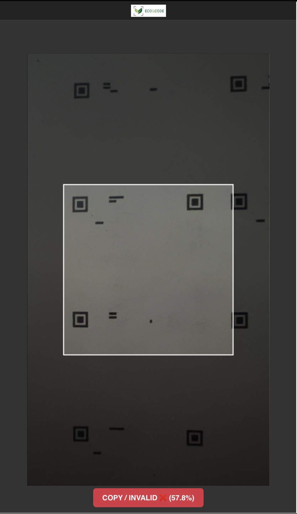

[English](README.md) | [한국어](README.ko.md) | **日本語**

---

# TrueQR: QRコード偽造防止プロジェクト

## 概要

このプロジェクトの主な目標は、オリジナルのセキュアなQRコードと、スキャンやコピーによって作成された偽造版を区別できるロジックを開発することでした。中心的なアイデアは、オリジナルのQRコード画像に脆弱な「暗号化」またはデジタルウォーターマークを埋め込むことです。このウォーターマークは、コピープロセス中に破壊されるか、大幅に変更されるように設計されており、それによって偽造品の検出を可能にします。

このドキュメントでは、その方法論、管理されたデジタル環境での成功、そして物理的な媒体とカメラを使用する実際のシナリオに技術を適用する際に発見された課題について概説します。

## コアコンセプトと方法論

検証プロセスは、一般的なコピーの痕跡を探すのではなく、QRコードのピクセルデータに埋め込まれた特定の脆弱な信号の劣化を検出するように設計されています。この埋め込まれたウォーターマークは、通常の表示には耐えられるほど堅牢でありながら、印刷-スキャンまたはデジタル-アナログ変換プロセスによって破壊されるほど脆弱に設計されています。

### 1. 知覚ハッシュ (pHash)

**知覚ハッシュ（Perceptual Hash, pHash）**は、画像の**低周波成分**に基づいて**フィンガープリント**を生成する方法です。このフィンガープリントは、**QRコードの構造**の全体的な表現を提供し、**わずかなスケーリング**や**圧縮**には堅牢ですが、全体の構造が変更されると値が変わります。処理プロセスは次のように分けられます。

#### **pHash生成ステップ：**

1.  **画像をグレースケールに変換し、サイズを調整**

    まず、画像 $I$ を**グレースケールに変換**し、固定サイズ（例：$32 \times 32$）に調整します。

    > **グレースケール変換とは？**
    > 
    > グレースケール変換は、カラー画像の各ピクセルが持つR（赤）、G（緑）、B（青）の3チャンネルの色情報を**単一チャンネルの輝度情報**に圧縮するプロセスです。つまり、「カラー」を「白黒の濃淡」に変える作業です。
    > 
    > 広く使われている変換式は、各色が人間の目にどれだけ明るく見えるかを重み付けしており、次のようになります。この式は、緑（G）を最も明るく、青（B）を最も暗く認識する人間の視覚特性を反映しています。
    > 
    > $$\\text{Grayscale} = (0.299 \\times R) + (0.587 \\times G) + (0.114 \\times B)$$
    > 
    > 例えば、`R=200, G=100, B=50`という色を持つピクセルは、上記の式によって約`118.2`という単一の輝度値に変換されます。このようにして、3次元の色情報を1次元の輝度情報に単純化します。

    -   このステップは、色情報を取り除いて画像を単純化し、サイズを一貫させることで、後続の演算（DCT）が構造的特徴にのみ集中できるようにします。

2.  **2D離散コサイン変換（DCT）を適用**

    グレースケールに変換された画像 $I$ に**2D DCT（離散コサイン変換）**を適用して、周波数領域の行列 $C$ に変換します。

    $$C = \text{DCT}(I)$$

    > **DCT（離散コサイン変換）の原理**
    > 
    > DCTは、画像のピクセル輝度値を**空間領域**から**周波数成分**に変換する強力な数学的ツールです。このプロセスを理解するために、まず基本的な**1D DCT**から見てみましょう。
    > 
    > 1次元データ配列（例：画像の一行）$f(x)$に対するDCT変換 $F(u)$は次のように定義されます。
    > 
    > **[ 1D DCTの式 ]**
    > 
    > $$F(u) = \alpha(u) \sum_{x=0}^{N-1} f(x) \cos\left[\frac{(2x+1)u\\pi}{2N}\right]$$
    > 
    > （このとき、$\\alpha(u)$は正規化係数で、$u=0$のときは$\\sqrt{1/N}$、$u>0$のときは$\\sqrt{2/N}$です。）
    > 
    > **2D DCT**は、この1D DCTを2次元に拡張したものです。画像のすべての**行**に1D DCTを適用し、その結果として得られた行列のすべての**列**に再び1D DCTを適用するのと同じ結果になります。2D DCTの完全な式は次のとおりです。
    > 
    > **[ 2D DCTの式 ]**
    > 
    > $$F(u,v) = \alpha(u) \alpha(v) \sum_{x=0}^{N-1} \sum_{y=0}^{M-1} f(x,y) \cos\left[\frac{(2x+1)u\\pi}{2N}\right] \cos\left(rac{(2y+1)v\\pi}{2M}\right)$$
    > 
    > この変換により、画像を構成する複雑な視覚情報を、「遅い変化」と「速い変化」を表す周波数成分に分解することができます。
    > 
    > -   **低周波:** 画像の中で色や明るさが**ゆっくりと変化する広い領域**を意味します。例えば、空や壁の滑らかな色合い、画像の全体的な構造や形状がこれに該当します。
    > -   **高周波:** ピクセル値が**急激に変化する部分**で、画像の細かいディテール、境界線、テクスチャ、ノイズなどを表します。
    > 
    > 2D DCTを適用すると、変換された行列（$C$）の**左上**には低周波成分が、**右下**に行くほど高周波成分が集中します。pHashは、この中で画像の核心的な骨格をなす低周波成分のみを使用するために、この変換プロセスを経ます。

    -   **要約:** DCTは画像を空間領域から**周波数領域**に変換し、これにより画像の**低周波**（大きな構造）と**高周波**（詳細）成分を分離することができます。

3.  **低周波の8x8領域を抽出**

    ステップ2でDCT変換を経ると、画像の周波数情報が行列の位置に応じて整列します。この原理を利用して、画像の核心構造を表す低周波領域を抽出します。

    > **なぜ左上が低周波領域なのか？**
    > 
    > 2D DCTの重要な特徴は、エネルギー集中効果です。ほとんどの視覚情報、つまりエネルギーを少数の低周波係数（左上）に集中させる性質があります。
    > 
    > -   **左上の`C[0,0]`（DC係数）:** 画像ブロックの**平均輝度**を表す最も重要な低周波成分です。通常、最も大きな値を持ちます。
    > -   **左上周辺:** DC係数から離れるほど（右、下に行くほど）、徐々に**より高い周波数**の成分を表し、これらの値は一般的に急激に小さくなります。
    > 
    > **[ 簡単な4x4行列の2D DCTの例 ]**
    > 
    > 理解を助けるために、左上が明るく右下が暗い簡単な4x4画像ブロックの輝度値があると仮定してみましょう。
    > 
    > **入力輝度値 (f(x, y))**
    > 
    > $$\begin{bmatrix}255 & 200 & 150 & 100 \\\\\ 200 & 150 & 100 & 50 \\\\\ 150 & 100 & 50 & 0 \\\\\ 100 & 50 & 0 & 0 \end{bmatrix}$$
    > 
    > この行列に**2D DCTを適用した結果 (F(u, v))**は次のようになります。（小数点以下四捨五入）
    > 
    > $$\begin{bmatrix}\mathbf{401} & \mathbf{-137} & \mathbf{27} & \mathbf{-8} & \\\\\mathbf{-137} & \mathbf{-2} & \mathbf{-8} & \mathbf{2} \\\\\mathbf{27} & \mathbf{-8} & \mathbf{2} & \mathbf{-2} \\\\\mathbf{-8} & \mathbf{2} & \mathbf{-2} & \mathbf{1}\end{bmatrix}$$
    > 
    > 結果を見ると、**最大のエネルギー（値の絶対値）が左上に集中**しており、右下に行くほど値が0に近づくことが明確に確認できます。

    pHashでは、全体の32x32 DCT行列のうち、このように核心エネルギーが集まっている**左上の8x8領域（$C_{\text{low}}$）のみを使用**します。これらの64個の係数は、画像の全体的な構造を表現するのに十分であり、JPEG圧縮などでも広く使用されている効率的な方法です。

    -   **要約:** 抽出された8x8の低周波成分は、画像の**全体的な輝度**と**核心的な形状**を代表します。

4.  **中央値を計算**

    抽出した8x8の低周波領域を0と1で構成されるハッシュに変換するための基準点を設定するステップです。8x8行列の最初の値である`C[0,0]`は、画像ブロック全体の平均輝度を表すため、構造的特徴を比較するには適していません。したがって、この値を除いた残りの63個の周波数係数を使用します。

    これらの63個の値の代表的な特徴を表す基準点を見つけるために、**中央値（median）**を計算します。中央値とは、与えられた値を大きさの順に並べたときに正確に中央に位置する値を意味します。例えば、`[1, 3, 5, 7, 9]`の5つの値があれば、中央値は`5`になります。

    $$m = \text{median}(C_{\text{low}}[1:, 1:])$$

    -   このように計算された中央値`m`は、次のステップでハッシュビットを0と1に決定する最終的な基準線（しきい値）の役割を果たします。

**5. 63ビットのハッシュを生成**

この最終ステップでは、先に計算した中央値`m`を基準（しきい値）として使用し、画像の低周波情報を63ビットの固有のデジタルフィンガープリント、すなわち**知覚ハッシュ（pHash）**に変換します。

具体的なプロセスは次のとおりです。ステップ3で抽出した8x8の低周波領域（`C_low`）には、合計64個の周波数係数があります。これらの係数を中央値（$m$）と比較して、0または1に変換します。

ここで重要な点は、64個の係数のうち、平均輝度である**DC成分（`C[0,0]`）はこの比較プロセスから除外される**ことです。画像の構造を表す63個のAC係数のみがハッシュを構成するために使用されます。これが「64ビット」ではなく「63ビット」のハッシュが生成される理由です。

各AC係数（$c_i$）を中央値（$m$）と比較するルールは次のとおりです。

$$h_i = \begin{cases} 1 & \\text{if } c_i > m \\\\0 & \\text{otherwise}\end{cases}$$

-   **解釈:** 63個のAC係数それぞれについて、その値が中央値`m`より**大きい場合は1**、小さいか等しい場合は**0**を割り当てます。

> **[ 簡単なハッシュ生成の例 ]**
> 
> もし63個のAC係数のうち最初の5つが`[15.3, -20.1, 5.5, 30.9, -2.0]`で、ステップ4で計算された中央値`m`が`4.5`だと仮定してみましょう。
> 
> 各係数を`m`と比較した結果は次のようになります。
> -   `15.3 > 4.5`  -> ビット割り当て: `1`
> -   `-20.1 > 4.5` -> ビット割り当て: `0`
> -   `5.5 > 4.5`  -> ビット割り当て: `1`
> -   `30.9 > 4.5` -> ビット割り当て: `1`
> -   `-2.0 > 4.5` -> ビット割り当て: `0`
> 
> このプロセスを63回繰り返すと、`10110...`のような63桁のバイナリ文字列が作成されます。

-   **要約:** このプロセスは63ビットの**バイナリ文字列**を生成し、これが最終的な画像の**知覚ハッシュ**となります。このハッシュは、画像の低周波構造を固有に表すフィンガープリントの役割を果たします。

#### **ハミング距離を用いた検証:**
**テスト画像**のpHash（$H_{\text{test}}$）と**参照画像**のpHash（$H_{\text{ref}}$）の間の**ハミング距離** $d_H$を計算します。
$$d_H(H_{\text{test}}, H_{\text{ref}}) = \sum_{i=1}^{63} \left| h_{\text{test}, i} - h_{\text{ref}, i} \right|$$
- このハミング距離が特定のしきい値$\\tau_p$以下であれば、検証を通過します。

$$d_H(H_{\text{test}}, H_{\text{ref}}) \leq \tau_p$$

- 距離が小さいほど、2つの画像は**類似**しているか**一致**していると見なされます。

#### **pHashの要約:**

-   **pHash**は、画像の**低周波成分**に基づいて**固有のフィンガープリント**を生成します。
-   **スケーリング**や**圧縮**のような**軽微な変更には堅牢**ですが、画像の**全体的な構造**が変わると値も変更されます。
-   **ハミング距離**は、2つのハッシュ値を比較して画像の類似性を検証するために使用されます。

#### **pHashの活用分野:**
-   重複画像の検出
-   類似度比較のための画像照合
-   知覚的類似性に基づいた効率的な画像インデックス作成

### 2. 高周波グリッド（HFG）強度

この指標は、コピー時に容易に損傷する**脆弱なウォーターマーク**を画像に挿入し、その損傷の有無を測定して真贋を判定する技術です。

#### ウォーターマーク挿入の原理
オリジナルの「セキュアな」画像には、人間の目には見えない微細な格子（グリッド）パターンが隠されています。このパターンは、以下のような方法で作成されます。

1.  画像全体に一定の間隔（$s$）で「グリッドポイント」を設定します。
2.  これらのグリッドポイントに対応するピクセルの輝度値を、周囲のピクセルよりも**ごくわずかに高くします**（例：元の輝度が150だった場合、155に変更）。

この微細な差は、通常の視覚では認識できませんが、印刷後にスキャンしたり、画面を撮影したりするなど、コピープロセスに必然的に発生する**ぼやけ（ブラー）現象**によって容易に破壊されます。

#### 検証の原理と例
検証時には、画像からグリッドポイントの平均輝度と、グリッド以外の残りのピクセルの平均輝度を比較して、その差を計算します。

> **[ 簡単な4x4画像のHFG強度計算の例 ]**
> 
> 理解を助けるために、間隔を2（$s=2$）に設定した4x4画像ブロックがあると仮定してみましょう。グリッドポイントは(0,0)、(0,2)、(2,0)、(2,2)の位置になります。
> 
> **1. 正規品画像の場合**
> 
> グリッドポイントの輝度（110）が周囲（100）よりもわずかに高く維持されます。
> 
> **入力画像 $I_{\text{正規品}}$**
> 
> $$\\begin{bmatrix}\\mathbf{110} & 100 & \\mathbf{110} & 100 \\\\\ 100 & 100 & 100 & 100 \\\\\mathbf{110} & 100 & \\mathbf{110} & 100 \\\\\ 100 & 100 & 100 & 100 \\end{bmatrix}$$
> 
> -   **グリッドピクセル平均（$\\mu_G$）:** `(110 + 110 + 110 + 110) / 4 = 110`
> -   **非グリッドピクセル平均（$\\mu_{\\neg G}$）:** `(100 * 12) / 12 = 100`
> -   **HFG強度（$S_{HFG}$）:** `110 - 100 =` **`10`**
> 
> **2. 偽造（コピー）画像の場合**
> 
> 印刷-スキャンプロセスのぼやけ現象により、グリッドポイントの高い輝度値が周囲に広がり、全体的に平準化されます。
> 
> **入力画像 $I_{\text{偽造}}$**
> 
> $$\\begin{bmatrix}\\mathbf{102} & 101 & \\mathbf{102} & 101 \\\\\ 101 & 101 & 101 & 101 \\\\\mathbf{102} & 101 & \\mathbf{102} & 101 \\\\\ 101 & 101 & 101 & 101 \\end{bmatrix}$$
> 
> -   **グリッドピクセル平均（$\\mu_G$）:** `(102 + 102 + 102 + 102) / 4 = 102`
> -   **非グリッドピクセル平均（$\\mu_{\\neg G}$）:** `(101 * 12) / 12 = 101`
> -   **HFG強度（$S_{HFG}$）:** `102 - 101 =` **`1`**

**検証:**
例で見たように、正規品画像のHFG強度（10）は偽造品（1）に比べてはるかに高いです。この原理を利用して、測定された強度$S_{HFG}$が事前に設定された最小しきい値$\\tau_h$以上であれば、正規品と判定します。

$$S_{HFG}(I_{test}) \\ge \\tau_h$$

もししきい値$\\tau_h$が`5`であれば、正規品画像は通過し、偽造画像は失敗します。

### 3. 周波数ピーク比（FPR）

この技術は、画像に特定の周波数を持つ「秘密の信号」を隠しておき、その信号の鮮明度を測定して真贋を判定する方式です。ラジオに例えるなら、画像に私たちだけが知っている特定の周波数（`k` MHz）で秘密のラジオ放送を送信し、スキャンされた画像でその放送がまだ鮮明に聞こえるかを確認するようなものです。

#### ウォーターマーク挿入の原理
オリジナル画像の各行（または列）にわたって、特定の周波数$k$を持つ周期的な信号（サイン波）を非常に微細に追加します。これにより、画像には肉眼で識別するのが難しい、水平または垂直方向の微かな輝度の波が生じます。この繊細なパターンは、画像圧縮、リサンプリング、印刷-スキャンプロセスで発生するデータ損失に非常に脆弱です。

#### 検証の原理と例
検証時には、画像から一行のピクセルデータ（信号）を抽出し、**フーリエ変換（FFT）**を介して周波数成分を分析します。

1.  **信号抽出とフーリエ変換（FFT）**

    画像の中央にある一行のピクセル輝度値（$r(x)$）を離散信号$x_n$とみなし、これに**離散フーリエ変換（DFT）**を適用します。（FFTは、このDFTを高速に計算する効率的なアルゴリズムの名前です。）

    **[ 1D離散フーリエ変換（DFT）の式 ]**

    $$X_k = \sum_{n=0}^{N-1} x_n \cdot e^{-i \\frac{2\\pi}{N} kn}$$

    この式は、入力信号（$x_n$）がそれぞれの周波数成分（$k$）をどれだけ含んでいるかを計算します。結果の値$X_k$は複素数であり、私たちはこの値の**大きさ（マグニチュード）**、すなわち$M(k) = |X_k|$にのみ関心があります。この大きさが、その周波数の「信号の強さ」を表します。

3.  **正規品画像のスペクトル**

    正規品画像には、私たちが埋め込んだ周波数$k$のサイン波が鮮明に残っているため、周波数スペクトルでその地点の**信号が非常に強力なピーク**を形成します。

    -   目標周波数（$k$）での信号の大きさ: $M(k) = 150$
    -   周辺の背景周波数の平均的な大きさ: $\\mu_{bg} = 10$
    -   **ピーク比（$R_{FP}$）:** $M(k) / \\mu_{bg} = 150 / 10 =$ **`15`**

4.  **偽造（コピー）画像のスペクトル**

    コピープロセスで微細なサイン波パターンが損傷し、強力だったピークはぼやけて弱くなり、周囲のノイズと似てきます。

    -   目標周波数（$k$）での信号の大きさ: $M(k) = 25$
    -   周辺の背景周波数の平均的な大きさ: $\\mu_{bg} = 10$
    -   **ピーク比（$R_{FP}$）:** $M(k) / \\mu_{bg} = 25 / 10 =$ **`2.5`**

**検証:**
このように、正規品画像のピーク比（15）は偽造品（2.5）よりもはるかに高く現れます。この比率（$R_{FP}$）が事前に定められたしきい値$\\tau_f$以上であれば、「秘密の放送」が鮮明に受信されたと判断し、正規品として認証します。

$$R_{FP} = \\frac{M(k)}{\\mu_{bg}}$$

$$R_{FP}(I_{test}) \\ge \\tau_f$$

もししきい値$\\tau_f$が`7`であれば、正規品画像は通過しますが、偽造画像は通過できません。


## 結果と主な発見

### 1. デジタルPNG-PNG比較での成功

**この方法は、純粋にデジタルな文脈で非常に成功しました。** これは`src/test_verify.py`スクリプトを使用して検証でき、このスクリプトは元の信号処理ロジックを使用して脆弱なウォーターマークを確認します。

オリジナルのデジタル**セキュアな**画像に対してテストした場合、スクリプトはすべての画像を正規品として正確に識別します。

```
$ python src/test_verify.py --mode verify --input_dir "True_data/secured" --meta "config/signatures.json"

ecoqcode (1).png: GENUINE  |  detail={'hamming': 0, 'hf_strength': 0.573, 'fft_peak_ratio': 26.27, ...}
ecoqcode (10).png: GENUINE  |  detail={'hamming': 0, 'hf_strength': 0.540, 'fft_peak_ratio': 10.66, ...}
ecoqcode (11).png: GENUINE  |  detail={'hamming': 0, 'hf_strength': 0.568, 'fft_peak_ratio': 3.04, ...}
...
```

逆に、**シミュレートされたコピー**（印刷とスキャンによる劣化を模倣）に対してテストした場合、スクリプトはすべてのコピーを偽物として正確に識別します。

```
$ python src/test_verify.py --mode verify --input_dir "False_data/simulated_copies" --meta "config/signatures.json"

ecoqcode (1)_copy1.png: COPY/ALTERED  |  detail={'hamming': 4, 'hf_strength': 0.127, 'fft_peak_ratio': 3.46, ...}
ecoqcode (1)_copy2.png: COPY/ALTERED  |  detail={'hamming': 0, 'hf_strength': 0.052, 'fft_peak_ratio': 12.74, ...}
ecoqcode (1)_copy3.png: COPY/ALTERED  |  detail={'hamming': 4, 'hf_strength': 0.075, 'fft_peak_ratio': 1.60, ...}
...
```

これは、環境変数が排除された純粋なデジタル領域で、脆弱なウォーターマークを使用する核心的な原則が有効であることを確認します。視覚的には、2つのPNGファイルセットはほぼ同一に見えます。

### 2. 物理媒体の課題

プロジェクトの主な課題は、デジタルファイルから実際のアプリケーションに移行する際に現れました。スマートフォンカメラ（iPhone 13 Pro）を使用して印刷されたQRコードを検証しようとすると、結果は一貫していませんでした。

**不一致の理由:** 検証ロジックは非常に敏感で、媒体自体の物理的特性に影響を受けました。推論結果は以下によって変化しました。
*   用紙の質感、光沢、色。
*   周囲の照明条件。
*   カメラの特定の角度と距離。

これは、システムが安定して動作するためには**高度に管理された環境**が必要であることを意味します。たとえば、QRコードが常に管理された照明の下で特定の標準化された種類の用紙に印刷される場合、検証が可能です。これは、この方法の普遍的な適用可能性を制限しますが、印刷媒体を標準化できる高セキュリティシナリオでの実行可能性を証明します。

### 3. ケーススタディ：ディスプレイからのiPhone 13 Proカメラ推論

実際の検証の課題をさらに調査するために、特定のテストが実施されました。本物の暗号化されたQRコードと既知の偽造QRコードを画面に表示し、その後iPhone 13 Proを使用してスキャンしました。

**テスト1：本物のQRコードのスキャン**

.jpg)

*   **結果:**
    *   `pHash Dist : 12 (Max : 18) -> OK`
    *   `FFT Ratio : 8.589 (Min : 1.5) -> OK`
    *   `HF Strength: -0.365 (Min: 0.15) -> NO`

**テスト2：偽造QRコードのスキャン**

.jpg)

*   **結果:** 偽造されたコードはほぼ同じ結果を生成し、`pHash Dist`と`FFT Ratio`のチェックを通過しましたが、`HF Strength`は失敗しました。

**分析:**
重要な洞察は、これら2つのテストを比較することから得られます。一見すると、本物のテストは3つのメトリックのうち2つを通過したため、部分的に成功したように見えます。しかし、既知の偽造品が*また*まったく同じ2つのメトリックを通過するという事実は、この文脈での検証を無意味にします。`HF Strength`メトリックは両方とも失敗しましたが、2つを区別できないため、信頼できない指標でもあります。

**結論:**
この比較テストは、ディスプレイで確認する場合、現在のロジックが本物のコードと偽造コードを区別できないことを証明します。画面の表示プロパティ（ピクセル、光など）は、スキャンされる*すべて*のQRコードに対して一貫したアーティファクトセットを生成し、`pHash`および`FFT`チェックで偽陽性を引き起こします。これは、**画面からの検証が現在この方法では不可能である**という結論を補強します。

### 3. アプローチの進化：信号処理からディープラーニングへ

初期のテスト、特に画面からのスキャンに関連するテストは、信号処理方法が脆弱すぎ、環境ノイズの影響を受けやすいことを示しました。管理されたデジタル環境では機能しましたが、より現実的なシナリオでは信頼できる結果を提供できませんでした。

**印刷物に関する初期のテストは、まちまちな結果をもたらしました。** 以下に示すように、本物の印刷されたQRコードは正確に識別されました。

.jpg)

しかし、高品質の偽物（A4用紙のコピー）でテストすると、システムは苦戦しました。しばしば偽物として識別しましたが、時には本物として誤分類し、この方法の信頼性を損ないました。

_1.jpg)
_2.jpg)
*キャプション：しばしば偽物として検出されましたが、これらの高品質のコピーは時々本物として誤分類されました。*

これらの制限を克服し、より堅牢な検証システムを構築するために、プロジェクトは**畳み込みニューラルネットワーク（CNN）を使用するディープラーニングアプローチ**に転換しました。新しい目標は、単一の脆弱な埋め込み信号に依存するのではなく、本物のQRコードと偽のQRコードを区別する視覚的特徴を学習するようにモデルをトレーニングすることでした。

#### 3.1 CNNモデルのデータ収集

現実的なバリエーションに焦点を当ててモデルをトレーニングするために、包括的なデータセットが収集されました。

**本物データ（155オリジナル）：**
*   **高品質（62画像）：** セキュアなQRコードを印刷し、iPhone 13 Proで撮影しました。
    *   暗い環境で31画像。
    *   明るい自然光で31画像。
*   **低品質（93画像）：** 堅牢性を向上させるために、遠くから追加の画像をキャプチャし、解像度を下げました。
    *   暗い環境で31画像。
    *   明るい蛍光灯の下で31画像。
    *   明るい自然光で31画像。

**偽物データ（124オリジナル）：**
*   **第1世代コピー（62画像）：** オリジナルの印刷されたQRを一度コピーしました。
*   **第2世代コピー（62画像）：** 第1世代のコピーを再度コピーして、さらなる劣化をシミュレートしました。

#### 3.2 データ拡張

より大きく、より多様なトレーニングセットを作成するために、すべての279のオリジナル画像（本物155 + 偽物124）を**10倍に拡張**しました。拡張には、以下のランダムなバリエーションが含まれていました。
*   ノイズ
*   明るさ

これにより、トレーニングと検証のための合計2,790画像のデータセットが生成されました。

#### 3.3 モデルのトレーニングとパフォーマンス

拡張されたデータセットでCNNモデルをトレーニングしました。トレーニングプロセスは非常に有望な結果をもたらし、**99％以上の検証精度**を達成しました。これは、モデルが本物と偽のQRコード画像を効果的に区別する方法を学習したことを示しています。

#### 3.3.1 モデルアーキテクチャ

このモデルは、よく知られた事前トレーニング済みのアーキテクチャを使用し、**転移学習**を活用しています。このアプローチにより、モデルは大規模なデータセット（ImageNet）で学習した強力な特徴抽出機能を活用できます。

アーキテクチャは、2つの主要な部分で構成されています。

1.  **ベースモデル:** `tf.keras.applications`の`MobileNetV2`。
    *   `imagenet`の重みで初期化されます。
    *   ベースモデル全体は「凍結」（`trainable = False`）されており、トレーニング中に重みは更新されません。固定の特徴抽出器として機能します。

2.  **カスタム分類器ヘッド:** 特定のバイナリ分類タスク（本物対偽物）に合わせて、`MobileNetV2`ベースの上に新しいレイヤーセットが追加されました。
    *   `GlobalAveragePooling2D`: ベースモデルからの特徴の空間次元を削減します。
    *   `Dropout (rate=0.2)`: 過学習を防ぐための正則化手法です。
    *   `Dense (1, activation='sigmoid')`: 0と1の間の確率スコアを出力するシグモイド活性化関数を持つ単一ニューロンの最終出力レイヤーです。

モデルは、バイナリ分類タスクの標準的な選択である`Adam`オプティマイザ（学習率0.001）と`BinaryCrossentropy`損失関数でコンパイルされました。

**モデルの概要:** 

```
Model: "functional"
_________________________________________________________________
 Layer (type)                Output Shape              Param #
=================================================================
 input_layer (InputLayer)    [(None, 224, 224, 3)]     0

 mobilenetv2_1.00_224        (None, 7, 7, 1280)        2,257,984
 (Functional)

 global_average_pooling2d    (None, 1280)              0
 (GlobalAveragePooling2D)

 dropout (Dropout)           (None, 1280)              0

 dense (Dense)               (None, 1)                 1,281
=================================================================
 Total params: 2,259,265
 Trainable params: 1,281
 Non-trainable params: 2,257,984
```
*（注：前処理レイヤーはモデルの一部ですが、簡潔にするためにこの要約では省略されています。）*

精度と損失曲線を含む詳細なトレーニング履歴は、こちらで確認できます。


#### 3.4 検証と限界分析

トレーニングが成功した後、モデルのパフォーマンスは、`src/visual_test.py`スクリプトを使用してさまざまなデータカテゴリでどのように実行されるかを評価されました。

下の画像に示されている結果は、モデルのロジックに致命的な欠陥があることを示しました。


**分析:**
*   **成功:** このモデルは、本物の印刷されたQRコードの写真（`Augmented (True)`）と単純な紙のコピーの写真（`Augmented (False)`）を区別するのに非常に効果的です。
*   **失敗:** このモデルは、すべてのデジタルで変更された偽物（`Simulated Copies (Expected: False)`）を「True」として誤分類します。

この結果は、モデルが私たちが埋め込んだ*特定*の脆弱なウォーターマークパターンを学習していないことを強く示唆しています。代わりに、印刷物の写真とコピーの写真を区別するより一般的な特徴（例：テクスチャ、モアレパターン、微妙な照明の変化）に基づいて予測しているようです。本質的に、*正しい*パターンではなく、*すべて*の印刷物のようなパターンの存在を検出しています。

#### 4. ハイブリッドモデルを使用したさらなる実験

初期の分析結果は、CNNモデルが特定のウォーターマークを学習していないことを示しました。次の論理的なステップは、ウォーターマークの定量的特徴をより直接的に分析できるモデルを作成することでした。

#### 4.1 実験1：デジタルデータに関するハイブリッドモデル
モデルが特定のパターンを学習するように強制するために、ハイブリッドアプローチが開発されました。このマルチ入力モデルは、画像データだけでなく、各デジタル画像に関連付けられた3つの署名値（`phash`、`hf_strength`、`fft_peak_ratio`）についてもトレーニングされました。モデルは`secured`（True）および`simulated_copies`（False）データセットでトレーニングされました。下の図に示すように、トレーニング自体は非常に成功し、ほぼ完璧な検証精度を達成しました。


しかし、優れたトレーニング結果にもかかわらず、視覚的なテスト結果は、実際の画像（カメラで撮影した写真）ではモデルが完全に失敗し、すべてを`false`として分類したことを示しました。これは、脆弱なウォーターマークが印刷およびスキャンプロセスによって破壊されたことを確認しました。


#### 4.2 実験2：実際のデータに関するハイブリッドモデル
カメラ画像での失敗を考慮して、次の実験は、より現実的なデータセット（`augmented_data`）で同じハイブリッドモデルをトレーニングすることでした。しかし、結果はほぼ同じでした。モデルは、生のデジタルQRコードを正しく分類する方法を学習しましたが、本物の印刷物の写真とコピーの写真の間の意味のある区別を見つけることができませんでした。


これは、この特定の脆弱なウォーターマーキング方法が、ハイブリッドモデルで分析しても、物理的な印刷-スキャン-検証ワークフローに十分に堅牢ではないという結論につながりました。

### 5. CNNモデルとサイズ依存性分析を使用した最終検証

主な目標はカメラベースの推論であり、ハイブリッドモデルが実際のデータで満足のいく結果を出さなかったため、最も有望に見えた元のCNNのみのモデルに戻りました。Webカメラアプリケーションを使用して、実際のパフォーマンスを検証するためにライブテストが実施されました。

#### 5.1 標準サイズのQRコードでの成功した検証
結果は肯定的でした。A4用紙に印刷された標準サイズのQRコードでテストした場合、モデルは本物の印刷物とコピーを正常に区別できました。

*   **本物:** 元のソース（`Test_origin.jpg`）から印刷されたQRコードは、GENUINEとして正しく識別されました。
*   **コピー:** 第1世代および第2世代のコピー（`Test_Onecopy.jpg`、`Test_Doublecopy.jpg`）は、偽物として正しく識別されました。

これは、モデルがこれらの条件下でコピーによって引き起こされるウォーターマークパターンの劣化を識別できることを示しています。

| 本物のオリジナル | 第1世代コピー | 第2世代コピー |
| :---: | :---: | :---: |
|  |  |  |

#### 5.2 サイズ依存性と大きなQRコードでの失敗
より大きなサイズのQRコードでテストすると、重大な制限が発見されました。大きなQRを印刷してからコピーすると、モデルはコピーをGENUINEとして誤分類しました。

下の画像（`Test_BigQR.jpg`）は、Webアプリケーションからのリアルタイム推論結果を示しています。スキャンされているQRコードは**第1世代のコピー**ですが、モデルはそれを本物として誤って識別します。これは望ましくない結果です。


**分析:**
QRコードの物理的なサイズは重要な変数です。より大きなQRコードをコピーすると、埋め込まれた脆弱なパターンも拡大され、より堅牢になり、コピープロセスで破壊される可能性が低くなります。

*   **大きなコピー**では、かなりの数のウォーターマークパターンが視覚的に識別可能なままであり、これがモデルがそれを本物として分類する理由です。
*   **小さなコピー**では、これらのパターンはほぼ完全に除去されるか、識別できない点に縮小され、モデルがそれを偽物として正しく識別できます。

#### 5.3 最終結論
CNNのみのモデルは、標準のA4サイズの用紙でQRコードを検証するのに効果的です。この規模では、本物の印刷物とコピーを確実に区別できます。ただし、モデルの有効性は物理的な印刷サイズに大きく依存します。ウォーターマークパターンがコピープロセスに耐えるより大きなQRコードには効果的ではありません。これは、現在のシステムが実行可能であるが、信頼性の高い検証のために管理された印刷サイズが必要であることを意味します。

## 今後の発展の可能性

この研究の究極の目標は、次のように相反するが不可欠な2つの特性を両方満たすウォーターマークを開発することです。
1.  **完全な堅牢性:** 元のデジタルソースから印刷された後でも、通常のカメラで一貫して検出できるウォーターマーク。
2.  **完全な脆弱性:** 本物の印刷物がコピーされるときに完全に破壊されるか、認識できないほどに変更されるウォーターマーク。

本質的に、この課題は、元のQRコードに埋め込まれた固有のハッシュ化されたウォーターマークを確実に認識しながら、複製時には確実に破壊されることを保証する技術を開発することです。

これは依然として活発で挑戦的な研究分野です。時間とリソースの制約により、個人がこのようなシステムを開発することはかなりの努力を要しますが、私たちはこれが達成可能な技術であると信じています。高度な信号処理、新しい材料、または最適なパターンを生成するようにトレーニングされた機械学習モデルに関するさらなる研究により、この可能性が開かれる可能性があります。

## このプロジェクトの使用方法

### 前提条件
*   Python 3.x
*   必須のPythonライブラリ（例：OpenCV, NumPy, scikit-image）。pipを介してインストールできます。
    ```bash
    pip install opencv-python numpy scikit-image
    ```
*   Webベースの検証用：`Flask`および`ngrok`。
    ```bash
    pip install Flask
    ```

### 使用法1：PNGファイルの確認

ローカルのQRコード画像ファイルを確認するには、ターミナルで`test_verify.py`スクリプトを実行できます。

**コマンド:** 
```bash
python test_verify.py --image "path/to/your/qrcode.png"
```
スクリプトは画像を分析し、ファイルが本物か偽物かを出力します。

### 使用法2：Webベースのカメラ検証（実験的）

この設定を使用すると、コンピューターまたは携帯電話のカメラを使用してリアルタイム検証を試すことができます。

**注:** 上記のように、この方法は実験的であり、失敗する可能性が高いですが、意図された実際のアプリケーションを示しています。

**ステップ1：ローカルWebサーバーの起動**

Webアプリケーションは`OCR/`ディレクトリにあります。Flaskサーバーを起動します。ポート8000で実行されると仮定します。

```bash
cd OCR
python app.py
```

**ステップ2：ngrokでサーバーを公開**

最新のWebブラウザーは、カメラハードウェアにアクセスするために安全な`https://`接続を必要とします。`ngrok`は、ローカルサーバー用の安全なパブリックURLを作成するツールです。

**新しいターミナルウィンドウ**で、次のコマンドを実行します。

```bash
ngrok http 8000
```

**ステップ3：アプリケーションへのアクセス**

`ngrok`は、パブリックHTTPS URL（例：`https://random-string.ngrok.io`）を提供します。スキャンに使用するデバイス（例：iPhone）のWebブラウザーでこのURLを開きます。その後、サイトにカメラへのアクセス権を付与し、QRコードを確認してみることができます。

```
