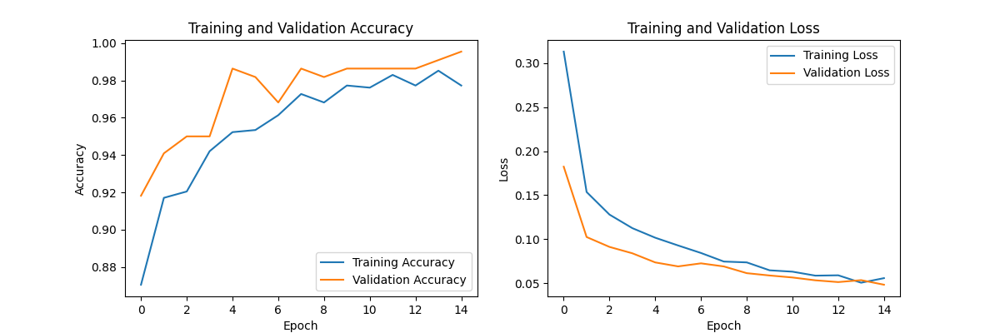

[English](README.md) | [한국어](README.ko.md) | **日本語**

---

# TrueQR: QRコード偽造検出プロジェクト

## 概要

このプロジェクトの主な目標は、オリジナルのセキュアなQRコードと、スキャンやコピーによって作成された偽造版を区別できるロジックを開発することでした。中心的なアイデアは、脆弱な「暗号化」またはデジタル透かしを元のQRコード画像に埋め込むことです。この透かしは、コピープロセス中に破壊されるか、大幅に変更されるように設計されており、偽造品を検出可能にします。

このドキュメントでは、方法論、制御されたデジタル環境での成功、および物理メディアとカメラを使用する実際のシナリオにこの技術を適用する際に発見された課題について概説します。

## コアコンセプトと方法論

検証プロセスは、コピーの一般的なアーティファクトを見つけるのではなく、QRコードのピクセルデータに埋め込まれた特定の脆弱な信号の劣化を検出するように設計されています。この埋め込まれた透かしは、通常の表示には耐えられるほど堅牢でありながら、印刷-スキャンまたはデジタル-アナログ変換プロセスによって破壊されるほど脆弱になるように設計されています。

この方法論には、画像の異なる特性を対象とする3つの主要な署名コンポーネントが含まれます。

#### 1. 知覚ハッシュ (pHash)

知覚ハッシュは、画像の低周波成分の「指紋」を作成するために使用されます。これにより、わずかなスケーリングや圧縮には堅牢ですが、全体的な構造が変更されると変化するQRコード構造の一般的な表現が提供されます。

プロセスは次のとおりです。
1.  画像$I$をグレースケールに変換し、固定サイズ（例：32x32）にリサイズします。
2.  2D離散コサイン変換（DCT）を適用します。
    $$C = \text{DCT}(I)$$
3.  低周波の$8 \times 8$サブ領域$C_{low}$を抽出します。
4.  $C_{low}$の係数の中央値$m$を計算します（DC成分$C[0,0]$を除く）。
5.  各ビット$h_i$が$C_{low}$の係数$c_i$に対応する63ビットのハッシュ$H$を生成します。
    $$ h_i = \begin{cases} 1 & \text{if } c_i > m \\ 0 & \text{otherwise} \end{cases} $$
    
**検証：** テスト画像のpHash（$H_{test}$）と参照画像のpHash（$H_{ref}$）の間のハミング距離$d_H$を計算します。距離が特定のしきい値$	au_p$未満の場合、チェックに合格します。
$$d_H(H_{test}, H_{ref}) \le \tau_p$$

#### 2. 高周波グリッド（HFG）強度

このメトリックは、画像全体に密かに埋め込まれた高周波パターンを測定します。元の「セキュアな」画像の微かなピクセルグリッドは、隣接するピクセルよりもわずかに明るくされています。この微妙な違いは、コピープロセスに固有のぼかしによって破壊されます。

1.  グリッド$G$は、グレースケール画像$I$から固定間隔$s$でピクセルをサンプリングすることによって定義されます。
    $$G = \{I(x, y) \mid x \pmod s = 0, y \pmod s = 0\}$$
2.  強度$S_{HFG}$は、グリッドピクセルの平均強度（$\\\mu_G$）と非グリッドピクセルの平均強度（$\\\mu_{\\\neg G}$）の差です。
    $$S_{HFG} = \\mu_G - \\mu_{\\\neg G}$$

**検証：** 本物の画像はグリッドポイントが明るいため、正の$S_{HFG}$値を持ちます。測定された強度が最小しきい値$	au_h$以上の場合、チェックに合格します。
$$S_{HFG}(I_{test}) \ge \tau_h$$

#### 3. 周波数ピーク比（FPR）

この技術は、画像の特定の既知の周波数$k$で、一方の軸に沿って周期的な信号（正弦波）を埋め込みます。これにより、画像の周波数スペクトルに、圧縮やリサンプリングのアーティファクトに非常に影響されやすい鋭いピークが作成されます。

1.  代表的な行$r(x)$（例：中央の行）を画像から抽出します。
2.  1D高速フーリエ変換（FFT）を計算します。
    $$R(f) = \text{FFT}(r(x))$$
3.  スペクトルの大きさ$M(f) = |R(f)|$を計算します。
4.  比率$R_{FP}$は、ターゲット周波数$M(k)$での大きさを、バックグラウンド周波数の平均的な大きさ$\\\mu_{bg}$で割ったものです。
    $$R_{FP} = \frac{M(k)}{\\\mu_{bg}}$$

**検証：** 本物の画像は周波数$k$で強いピークを示します。比率が最小しきい値$	au_f$以上の場合、チェックに合格します。
$$R_{FP}(I_{test}) \ge \tau_f$$


## 結果と主な調査結果

### 1. デジタルPNGからPNGへの比較での成功

**この方法は、純粋にデジタルな文脈で非常に成功しました。** これを検証するために、`src/test_verify.py`スクリプトを使用できます。このスクリプトは、元の信号処理ロジックを使用して脆弱な透かしをチェックします。

元のデジタルで**保護された**画像をテストすると、スクリプトはそれらすべてを本物として正しく識別します。

```
$ python src/test_verify.py --mode verify --input_dir "True_data/secured" --meta "config/signatures.json"

ecoqcode (1).png: GENUINE  |  detail={'hamming': 0, 'hf_strength': 0.573, 'fft_peak_ratio': 26.27, ...}
ecoqcode (10).png: GENUINE  |  detail={'hamming': 0, 'hf_strength': 0.540, 'fft_peak_ratio': 10.66, ...}
ecoqcode (11).png: GENUINE  |  detail={'hamming': 0, 'hf_strength': 0.568, 'fft_peak_ratio': 3.04, ...}
...
```

逆に、**シミュレートされたコピー**（印刷とスキャンによる劣化を模倣）をテストすると、スクリプトはそれらすべてを偽物として正しく識別します。

```
$ python src/test_verify.py --mode verify --input_dir "False_data/simulated_copies" --meta "config/signatures.json"

ecoqcode (1)_copy1.png: COPY/ALTERED  |  detail={'hamming': 4, 'hf_strength': 0.127, 'fft_peak_ratio': 3.46, ...}
ecoqcode (1)_copy2.png: COPY/ALTERED  |  detail={'hamming': 0, 'hf_strength': 0.052, 'fft_peak_ratio': 12.74, ...}
ecoqcode (1)_copy3.png: COPY/ALTERED  |  detail={'hamming': 4, 'hf_strength': 0.075, 'fft_peak_ratio': 1.60, ...}
...
```

これは、環境変数が排除された純粋なデジタル領域では、脆弱で破壊可能な透かしを使用するという中心的な原則が有効であることを裏付けています。肉眼では、2つのPNGファイルのセットはほとんど同じに見えます。

### 2. 物理メディアの課題

プロジェクトの主な課題は、デジタルファイルから実際のアプリケーションに移行する際に現れました。スマートフォンカメラ（iPhone 13 Pro）を使用して印刷されたQRコードを検証しようとすると、結果に一貫性がなくなりました。

**一貫性のない理由：** 検証ロジックは非常に敏感であったため、メディア自体の物理的特性に影響されました。推論結果は以下に基づいて変化しました。
*   紙の質感、光沢、色。
*   周囲の照明条件。
*   カメラの特定の角度と距離。

これは、システムが確実に機能するためには、**高度に制御された環境**が必要であることを意味します。たとえば、QRコードが常に制御された照明の下で特定の標準化された種類の紙に印刷されている場合、検証が可能です。これにより、この方法の普遍的な適用性は制限されますが、印刷媒体を標準化できる高セキュリティシナリオでの実行可能性が証明されます。

### 3. ケーススタディ：ディスプレイからのiPhone 13 Proカメラ推論

実際の検証の課題をさらに調査するために、特定のテストが実施されました。本物の暗号化されたQRコードと既知の偽造QRコードが画面に表示され、iPhone 13 Proを使用してスキャンされました。

**テスト1：本物のQRコードのスキャン**

.jpg)

*   **結果：**
    *   `pHash Dist : 12 (Max : 18) -> OK`
    *   `FFT Ratio : 8.589 (Min : 1.5) -> OK`
    *   `HF Strength: -0.365 (Min: 0.15) -> NO`

**テスト2：偽造QRコードのスキャン**

.jpg)

*   **結果：** 偽造コードはほぼ同じ結果を生成し、`pHash Dist`と`FFT Ratio`のチェックにも合格しましたが、`HF Strength`は失敗しました。

**分析：**
重要な洞察は、これら2つのテストを比較することから得られます。一見すると、本物のテストは3つのメトリックのうち2つに合格したため、部分的に成功したように見えます。しかし、既知の偽造品が*また*まったく同じ2つのメトリックに合格するという事実は、この文脈での検証には役に立たないことを意味します。`HF Strength`メトリックは両方で失敗しましたが、2つを区別できないため、信頼性の低い指標でもあります。

**結論：**
この比較テストは、ディスプレイから検証する場合、現在のロジックでは本物のコードと偽造コードを区別できないことを証明しています。画面の表示プロパティ（ピクセル、光など）は、スキャンされる*すべての*QRコードに対して一貫したアーティファクトのセットを作成し、`pHash`および`FFT`チェックで誤検知を引き起こします。これは、**画面からの検証は現在この方法では不可能である**という結論を補強します。

### 3. アプローチの進化：信号処理からディープラーニングへ

初期のテスト、特に画面からのスキャンを含むテストでは、信号処理法が脆弱すぎて環境ノイズの影響を受けやすいことが明らかになりました。制御されたデジタル環境では機能しましたが、より現実的なシナリオでは信頼できる結果を提供できませんでした。

**印刷物を使用した初期のテストでは、さまざまな結果が得られました。** 以下に示すように、本物の印刷されたQRコードは正しく識別されました。

.jpg)

しかし、高品質の偽物（A4用紙のコピー）でテストすると、システムは苦戦しました。多くの場合、それらを偽物として識別しましたが、時には本物として誤分類し、この方法の信頼性の低さを浮き彫りにしました。

_1.jpg)
_2.jpg)
*キャプション：多くの場合、偽物として検出されましたが、これらの高品質のコピーは時々本物として誤分類されました。*

これらの制限を克服し、より堅牢な検証システムを構築するために、プロジェクトは**畳み込みニューラルネットワーク（CNN）を使用したディープラーニングアプローチ**に軸足を移しました。新しい目標は、単一の脆弱な埋め込み信号に頼るのではなく、本物のQRコードと偽物のQRコードを区別する視覚的特徴をモデルに学習させることでした。

#### 3.1 CNNモデルのデータ収集

現実的なバリエーションに焦点を当てて、モデルをトレーニングするために包括的なデータセットが収集されました。

**本物のデータ（155オリジナル）：**
*   **高品質（62画像）：** 安全なQRコードが印刷され、iPhone 13 Proで撮影されました。
    *   暗い環境で31画像。
    *   明るい自然光で31画像。
*   **低品質（93画像）：** 堅牢性を向上させるために、遠くから追加の画像がキャプチャされ、解像度が低くなりました。
    *   暗い環境で31画像。
    *   明るい蛍光灯の下で31画像。
    *   明るい自然光で31画像。

**偽のデータ（124オリジナル）：**
*   **第1世代コピー（62画像）：** 元の印刷されたQRが1回コピーされました。
*   **第2世代コピー（62画像）：** 第1世代コピーが再度コピーされ、さらなる劣化がシミュレートされました。

#### 3.2 データ拡張

より大きく、より多様なトレーニングセットを作成するために、279のオリジナル画像すべて（155の本物+ 124の偽物）が**10倍に拡張**されました。拡張には、以下のランダムなバリエーションが含まれていました。
*   ノイズ
*   明るさ

これにより、トレーニングと検証のために合計2,790の画像のデータセットが作成されました。

#### 3.3 モデルのトレーニングとパフォーマンス

拡張データセットでCNNモデルがトレーニングされました。トレーニングプロセスは非常に有望な結果をもたらし、**99％を超える検証精度**を達成しました。これは、モデルが本物と偽物のQRコード画像を効果的に区別することを学習したことを示しています。

#### 3.3.1 モデルアーキテクチャ

このモデルは、事前トレーニング済みの確立されたアーキテクチャをベースとして使用することにより、**転移学習**を活用します。このアプローチにより、モデルは膨大なデータセット（ImageNet）から学習した強力な特徴抽出機能の恩恵を受けることができます。

アーキテクチャは、主に2つの部分で構成されています。

1.  **ベースモデル：** `tf.keras.applications`によって提供される`MobileNetV2`。
    *   `imagenet`の重みで初期化されます。
    *   ベースモデル全体が「フリーズ」され（`trainable = False`）、トレーニング中にその重みは更新されません。固定の特徴抽出器として機能します。

2.  **カスタム分類器ヘッド：** 特定のバイナリ分類タスク（本物と偽物）に適応させるために、`MobileNetV2`ベースの上に新しいレイヤーのセットが追加されました。
    *   `GlobalAveragePooling2D`：ベースモデルからの特徴の空間次元を削減します。
    *   `Dropout（rate = 0.2）`：過剰適合を防ぐための正則化手法。
    *   `Dense（1、activation = 'sigmoid'）`：0から1の間の確率スコアを出力するシグモイド活性化関数を持つ単一ニューロンの最終出力レイヤー。

モデルは、バイナリ分類タスクの標準的な選択肢である`Adam`オプティマイザー（学習率0.001）と`BinaryCrossentropy`損失関数でコンパイルされました。

**モデルの概要：**

```
Model: "functional"
_________________________________________________________________
 Layer (type)                Output Shape              Param #
=================================================================
 input_layer (InputLayer)    [(None, 224, 224, 3)]     0

 mobilenetv2_1.00_224        (None, 7, 7, 1280)        2,257,984
 (Functional)

 global_average_pooling2d    (None, 1280)              0
 (GlobalAveragePooling2D)

 dropout (Dropout)           (None, 1280)              0

 dense (Dense)               (None, 1)                 1,281
=================================================================
 Total params: 2,259,265
 Trainable params: 1,281
 Non-trainable params: 2,257,984
```
*（注：前処理レイヤーはモデルの一部ですが、簡潔にするためにこの要約からは省略されています。）*

精度と損失曲線を含む詳細なトレーニング履歴を以下に示します。



#### 3.4 検証と制限分析

トレーニングが成功した後、モデルのパフォーマンスは`src/visual_test.py`スクリプトを使用して、さまざまなデータカテゴリでどのように実行されるか評価されました。

以下の画像に示す結果は、モデルのロジックに重大な欠陥があることを明らかにしました。


**分析：**
*   **成功：** このモデルは、本物の印刷されたQRコードの写真（`Augmented（True）`）と単純な紙のコピーの写真（`Augmented（False）`）を区別するのに非常に効果的です。
*   **失敗：** このモデルは、デジタルで変更されたすべての偽物（`Simulated Copies（Expected：False）`）を「True」として誤って分類します。

この結果は、モデルが埋め込んだ*特定の*脆弱な透かしパターンを学習していないことを強く示唆しています。代わりに、印刷物の写真とコピーの写真を区別するより一般的な特徴（テクスチャ、モアレパターン、微妙な照明の変化など）に基づいて予測を行っているようです。本質的に、*正しい*パターンではなく、*あらゆる*印刷物のようなパターンの存在を検出しています。

### 4. ハイブリッドモデルによるさらなる実験

初期の分析では、CNNモデルが特定の透かしを学習していないことが示されました。次の論理的なステップは、透かしの定量的特徴をより直接的に分析できるモデルを作成することでした。

#### 4.1 実験1：デジタルデータに対するハイブリッドモデル
モデルに特定のパターンを学習させるために、ハイブリッドアプローチが開発されました。このマルチ入力モデルは、画像データだけでなく、各デジタル画像に関連付けられた3つの署名値（`phash`、`hf_strength`、`fft_peak_ratio`）でもトレーニングされました。モデルは`secured`（True）および`simulated_copies`（False）データセットでトレーニングされました。トレーニング結果は優れていましたが、視覚テストでは、モデルが実際の画像（カメラで撮影した写真）で完全に失敗し、すべてを`false`として分類することが示されました。これは、脆弱な透かしが印刷およびスキャンプロセスによって破壊されていることを裏付けています。


#### 4.2 実験2：実世界のデータに対するハイブリッドモデル
カメラ画像での失敗を考慮して、次の実験では、より現実的なデータセット（`augmented_data`）で同じハイブリッドモデルをトレーニングしました。しかし、結果はほぼ同じでした。モデルは、元のデジタルQRコードを正しく分類することを学習しましたが、本物の印刷物の写真とコピーの写真の間に意味のある区別を見つけることができませんでした。


これにより、この特定の脆弱な透かし方法は、ハイブリッドモデルで分析した場合でも、物理的な印刷-スキャン-検証ワークフローには十分に堅牢ではないという結論に至りました。

### 5. CNNモデルによる最終検証とサイズ依存性分析

主な目標はカメラベースの推論であり、ハイブリッドモデルが実世界のデータで満足のいく結果をもたらさなかったため、最も有望であった元のCNNのみのモデルに戻りました。Webカメラアプリケーションを使用してライブテストを実施し、その実世界のパフォーマンスを検証しました。

#### 5.1 標準サイズのQRコードでの検証成功
結果は良好でした。A4用紙に印刷された標準サイズのQRコードでテストした場合、モデルは本物の印刷物とコピーを正常に区別できました。

*   **本物：** 元のソース（`Test_origin.jpg`）から印刷されたQRコードは、GENUINEとして正しく識別されました。
*   **コピー：** 第1世代および第2世代のコピー（`Test_Onecopy.jpg`、`Test_Doublecopy.jpg`）は、偽造品として正しく識別されました。

これは、モデルがこれらの条件下でコピーによって引き起こされる透かしパターンの劣化を識別できることを示しています。

| 本物のオリジナル | 第1世代コピー | 第2世代コピー |
| :---: | :---: | :---: |
|  |  |  |

#### 5.2 サイズ依存性と大きなQRコードでの失敗
より大きなサイズのQRコードでテストすると、重大な制限が発見されました。大きなQRを印刷してコピーすると、モデルはコピーをGENUINEとして誤って分類しました。

以下の画像（`Test_BigQR.jpg`）は、Webアプリケーションからのリアルタイム推論結果を示しています。スキャンされているQRコードは**第1世代のコピー**ですが、モデルはそれを本物として誤って識別します。これは望ましくない結果です。


**分析：**
QRコードの物理的なサイズは重要な変数です。より大きなQRコードをコピーすると、埋め込まれた脆弱なパターンも拡大され、より堅牢になり、コピープロセスで破壊されにくくなります。

*   **大きなコピー**では、かなりの数の透かしパターンが視覚的に識別可能なままであり、そのためモデルはそれを本物として分類します。
*   **小さなコピー**では、これらのパターンはほぼ完全に除去されるか、不明瞭な点に縮小されるため、モデルはそれを偽物として正しく識別できます。

#### 5.3 最終結論
CNNのみのモデルは、標準のA4サイズの用紙でQRコードを検証するのに効果的です。このスケールでは、本物の印刷物とコピーを確実に区別できます。ただし、モデルの有効性は物理的な印刷サイズに大きく依存します。透かしパターンがコピープロセスを乗り切る大きなQRコードには効果的ではありません。これは、現在のシステムは実行可能ですが、信頼性の高い検証には制御された印刷サイズが必要であることを意味します。

## このプロジェクトの使用方法

### 前提条件
*   Python 3.x
*   必要なPythonライブラリ（例：OpenCV、NumPy、scikit-image）。pipを介してインストールできます。
    ```bash
    pip install opencv-python numpy scikit-image
    ```
*   Webベースの検証の場合：`Flask`および`ngrok`。
    ```bash
    pip install Flask
    ```

### 使用法1：PNGファイルの検証

ローカルのQRコード画像ファイルを検証するには、ターミナルから`test_verify.py`スクリプトを実行できます。

**コマンド：**
```bash
python test_verify.py --image "path/to/your/qrcode.png"
```
スクリプトは画像を分析し、ファイルが本物か偽物かを判断して出力します。

### 使用法2：Webベースのカメラ検証（実験的）

この設定により、コンピューターまたは電話のカメラを使用してリアルタイム検証を試みることができます。

**注：** 上記のように、この方法は実験的であり、失敗する可能性がありますが、意図した実際のアプリケーションを示しています。

**ステップ1：ローカルWebサーバーの起動**

Webアプリケーションは`OCR/`ディレクトリにあります。Flaskサーバーを起動します。ポート8000で実行されると想定されています。

```bash
cd OCR
python app.py
```

**ステップ2：ngrokでサーバーを公開する**

最新のWebブラウザーでは、カメラハードウェアにアクセスするために安全な`https://`接続が必要です。`ngrok`は、ローカルサーバー用の安全なパブリックURLを作成するツールです。

**新しいターミナルウィンドウ**で、次のコマンドを実行します。

```bash
ngrok http 8000
```

**ステップ3：アプリケーションへのアクセス**

`ngrok`は、パブリックHTTPS URL（例：`https://random-string.ngrok.io`）を提供します。スキャンに使用するデバイス（例：iPhone）のWebブラウザーでこのURLを開きます。その後、サイトにカメラへのアクセスを許可し、QRコードの検証を試みることができます。
