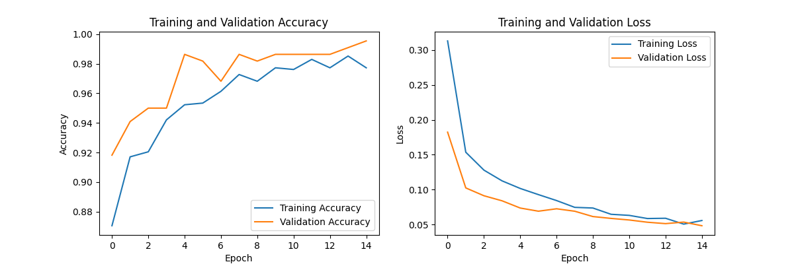
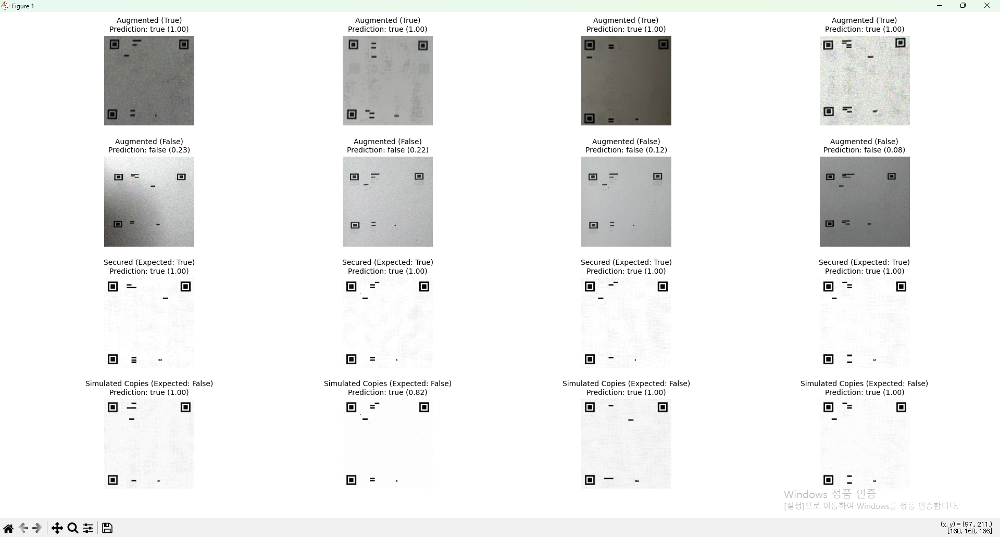
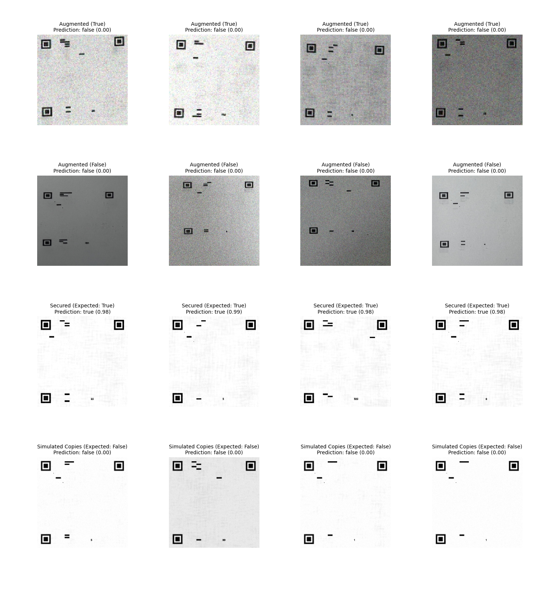
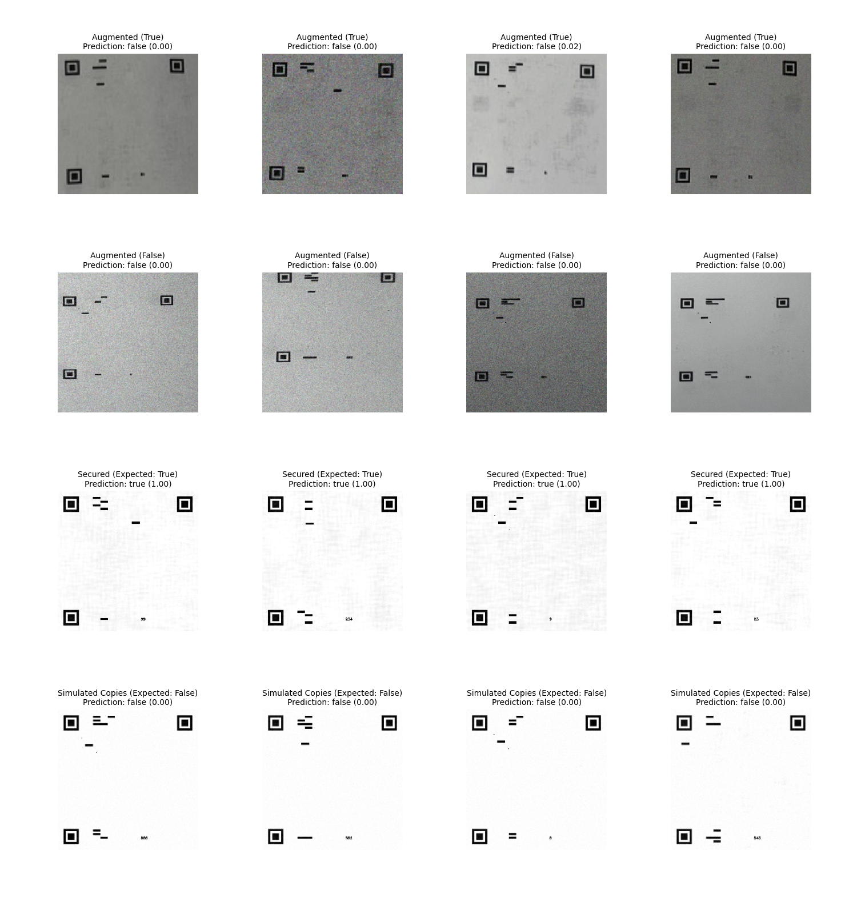
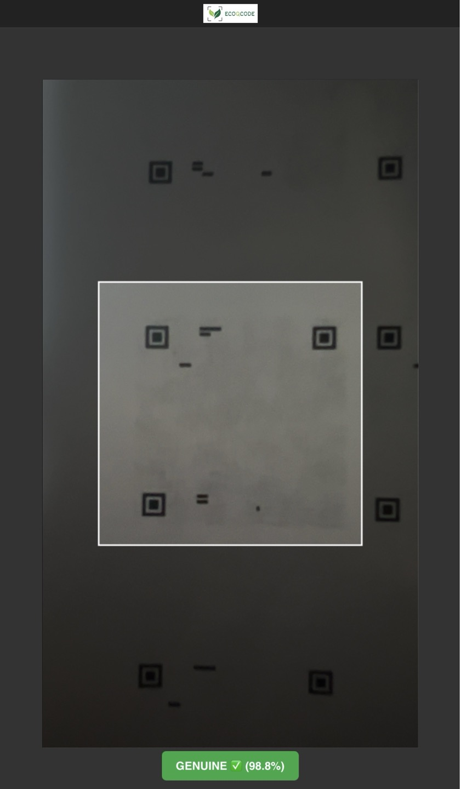
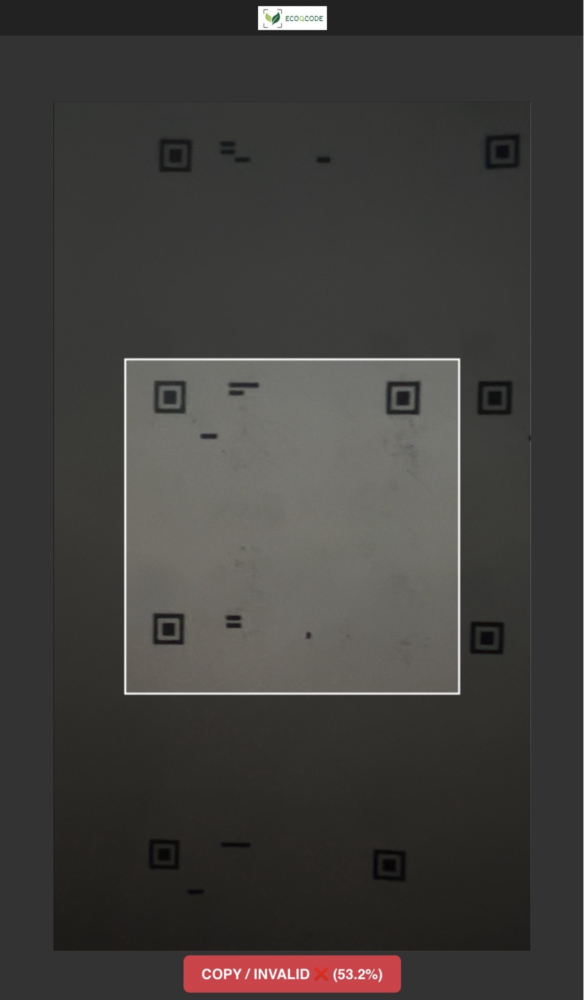
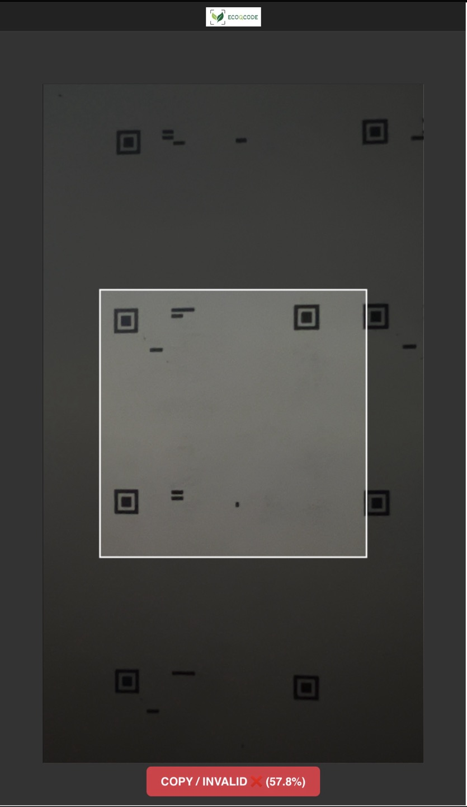
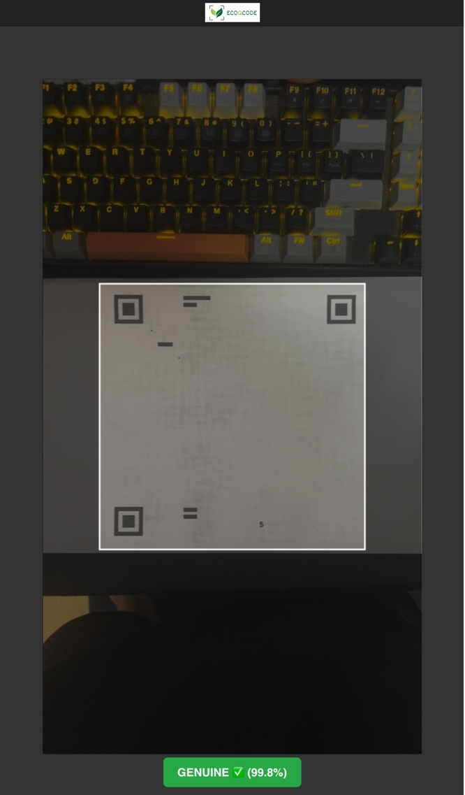

[English](README.md) | **한국어** | [日本語](README.ja.md)

---

# TrueQR: QR 코드 위조 방지 프로젝트

## 개요

이 프로젝트의 주요 목표는 원본 보안 QR 코드와 스캔 또는 복사로 생성된 위조 버전을 구별할 수 있는 로직을 개발하는 것이었습니다. 핵심 아이디어는 원본 QR 코드 이미지에 깨지기 쉬운 "암호화" 또는 디지털 워터마크를 삽입하는 것입니다. 이 워터마크는 복사 과정에서 파괴되거나 크게 변경되도록 설계되어 위조품을 탐지할 수 있게 합니다.

이 문서는 방법론, 통제된 디지털 환경에서의 성공, 그리고 물리적 매체와 카메라를 사용하는 실제 시나리오에 기술을 적용할 때 발견된 과제들을 간략하게 설명합니다.

## 핵심 개념 및 방법론

검증 프로세스는 일반적인 복사 흔적을 찾는 것이 아니라, QR 코드의 픽셀 데이터에 내장된 특정하고 깨지기 쉬운 신호의 저하를 감지하도록 설계되었습니다. 이 내장된 워터마크는 일반적인 보기에는 견딜 수 있을 만큼 충분히 튼튼하지만, 인쇄-스캔 또는 디지털-아날로그 변환 과정에 의해 파괴될 만큼 깨지기 쉽게 설계되었습니다.

방법론은 이미지의 다른 특성을 대상으로 하는 세 가지 주요 서명 구성 요소를 포함합니다.

#### 1. 지각 해시 (pHash)

지각 해시는 이미지의 저주파수 구성 요소의 "지문"을 만드는 데 사용됩니다. 이는 약간의 크기 조정 및 압축에 강하지만 전체 구조가 변경되면 변경되는 QR 코드 구조의 일반적인 표현을 제공합니다.

프로세스는 다음과:
1.  이미지 $I$를 그레이스케일로 변환하고 고정된 크기(예: 32x32)로 조정합니다.
2.  2D 이산 코사인 변환(DCT)을 적용합니다:
    $$C = \text{DCT}(I)$$
3.  저주파수 $8 \times 8$ 하위 영역 $C_{low}$를 추출합니다.
4.  $C_{low}$의 계수(DC 구성 요소 $C[0,0]$ 제외)의 중앙값 $m$을 계산합니다.
5.  각 비트 $h_i$가 $C_{low}$의 계수 $c_i$에 해당하는 63비트 해시 $H$를 생성합니다:
    $$ h_i = \begin{cases} 1 & \text{if } c_i > m \\ 0 & \text{otherwise} \end{cases} $$
    
**검증:** 테스트 이미지의 pHash($H_{test}$)와 참조 이미지($H_{ref}$) 사이의 해밍 거리 $d_H$를 계산합니다. 거리가 특정 임계값 $	au_p$ 미만이면 검사를 통과합니다:
$$d_H(H_{test}, H_{ref}) \le \tau_p$$

#### 2. 고주파 그리드(HFG) 강도

이 메트릭은 이미지 전체에 비밀리에 내장된 고주파 패턴을 측정합니다. 원본 "보안" 이미지의 희미한 픽셀 그리드는 인접 픽셀보다 약간 더 밝게 만들어집니다. 이 미묘한 차이는 모든 복사 과정에 내재된 흐림 현상에 의해 파괴됩니다.

1.  그리드 $G$는 그레이스케일 이미지 $I$에서 고정된 간격 $s$로 픽셀을 샘플링하여 정의됩니다:
    $$G = \{I(x, y) \mid x \pmod s = 0, y \pmod s = 0\}$$
2.  강도 $S_{HFG}$는 그리드 픽셀의 평균 강도($\mu_G$)와 비그리드 픽셀의 평균 강도($\mu_{\neg G}$)의 차이입니다:
    $$S_{HFG} = \mu_G - \mu_{\neg G}$$

**검증:** 정품 이미지는 그리드 포인트가 더 밝기 때문에 양수 $S_{HFG}$ 값을 갖습니다. 측정된 강도가 최소 임계값 $	au_h$ 이상이면 검사를 통과합니다:
$$S_{HFG}(I_{test}) \ge \tau_h$$

#### 3. 주파수 피크 비율(FPR)

이 기술은 이미지의 한 축을 따라 특정하고 알려진 주파수 $k$에서 주기적인 신호(사인파)를 내장합니다. 이것은 이미지의 주파수 스펙트럼에서 압축 및 리샘플링 아티팩트에 매우 취약한 날카로운 피크를 생성합니다.

1.  대표적인 행 $r(x)$(예: 중간 행)를 이미지에서 추출합니다.
2.  1D 고속 푸리에 변환(FFT)을 계산합니다:
    $$R(f) = \text{FFT}(r(x))$$
3.  스펙트럼의 크기 $M(f) = |R(f)|$를 계산합니다.
4.  비율 $R_{FP}$는 목표 주파수에서의 크기 $M(k)$를 배경 주파수의 평균 크기 $\mu_{bg}$로 나눈 값입니다:
    $$R_{FP} = \frac{M(k)}{\mu_{bg}}$$

**검증:** 정품 이미지는 주파수 $k$에서 강한 피크를 보입니다. 비율이 최소 임계값 $	au_f$ 이상이면 검사를 통과합니다:
$$R_{FP}(I_{test}) \ge \tau_f$$


## 결과 및 주요 발견

### 1. 디지털 PNG-PNG 비교에서의 성공

**이 방법은 순전히 디지털 맥락에서 매우 성공적이었습니다.** 이를 검증하기 위해 `src/test_verify.py` 스크립트를 사용할 수 있으며, 이 스크립트는 원래 신호 처리 로직을 사용하여 깨지기 쉬운 워터마크를 확인합니다.

원본 디지털 **보안** 이미지에 대해 테스트했을 때 스크립트는 모든 이미지를 정품으로 정확하게 식별합니다:

```
$ python src/test_verify.py --mode verify --input_dir "True_data/secured" --meta "config/signatures.json"

ecoqcode (1).png: GENUINE  |  detail={'hamming': 0, 'hf_strength': 0.573, 'fft_peak_ratio': 26.27, ...}
ecoqcode (10).png: GENUINE  |  detail={'hamming': 0, 'hf_strength': 0.540, 'fft_peak_ratio': 10.66, ...}
ecoqcode (11).png: GENUINE  |  detail={'hamming': 0, 'hf_strength': 0.568, 'fft_peak_ratio': 3.04, ...}
...
```

반대로 **시뮬레이션된 사본**(인쇄 및 스캔으로 인한 저하를 모방)에 대해 테스트했을 때 스크립트는 모든 사본을 가짜로 정확하게 식별합니다:

```
$ python src/test_verify.py --mode verify --input_dir "False_data/simulated_copies" --meta "config/signatures.json"

ecoqcode (1)_copy1.png: COPY/ALTERED  |  detail={'hamming': 4, 'hf_strength': 0.127, 'fft_peak_ratio': 3.46, ...}
ecoqcode (1)_copy2.png: COPY/ALTERED  |  detail={'hamming': 0, 'hf_strength': 0.052, 'fft_peak_ratio': 12.74, ...}
ecoqcode (1)_copy3.png: COPY/ALTERED  |  detail={'hamming': 4, 'hf_strength': 0.075, 'fft_peak_ratio': 1.60, ...}
...
```

이는 환경 변수가 제거된 순수한 디지털 영역에서 깨지기 쉬운 워터마크를 사용하는 핵심 원칙이 유효함을 확인시켜 줍니다. 육안으로는 두 PNG 파일 세트가 거의 동일하게 보입니다.

### 2. 물리적 매체의 과제

프로젝트의 주요 과제는 디지털 파일에서 실제 응용 프로그램으로 이동할 때 나타났습니다. 스마트폰 카메라(iPhone 13 Pro)를 사용하여 인쇄된 QR 코드를 확인하려고 할 때 결과가 일관되지 않았습니다.

**불일치 이유:** 검증 로직이 너무 민감하여 매체 자체의 물리적 특성에 영향을 받았습니다. 추론 결과는 다음에 따라 변경되었습니다:
*   용지의 질감, 광택 및 색상.
*   주변 조명 조건.
*   카메라의 특정 각도 및 거리.

이는 시스템이 안정적으로 작동하려면 **고도로 통제된 환경**이 필요함을 의미합니다. 예를 들어, QR 코드가 항상 통제된 조명 아래 특정 표준화된 유형의 용지에 인쇄되는 경우 검증이 가능합니다. 이는 방법의 보편적인 적용 가능성을 제한하지만, 인쇄 매체를 표준화할 수 있는 높은 보안 시나리오에 대한 실행 가능성을 증명합니다.

### 3. 사례 연구: 디스플레이에서 iPhone 13 Pro 카메라 추론

실제 검증의 과제를 추가로 조사하기 위해 특정 테스트를 수행했습니다. 정품 암호화된 QR 코드와 알려진 위조 QR 코드를 화면에 표시한 다음 iPhone 13 Pro를 사용하여 스캔했습니다.

**테스트 1: 정품 QR 코드 스캔**

.jpg)

*   **결과:**
    *   `pHash Dist : 12 (Max : 18) -> OK`
    *   `FFT Ratio : 8.589 (Min : 1.5) -> OK`
    *   `HF Strength: -0.365 (Min: 0.15) -> NO`

**테스트 2: 위조 QR 코드 스캔**

.jpg)

*   **결과:** 위조된 코드는 거의 동일한 결과를 생성했으며, `pHash Dist` 및 `FFT Ratio` 검사를 통과했지만 `HF Strength`는 실패했습니다.

**분석:**
중요한 통찰력은 이 두 테스트를 비교하는 데서 나옵니다. 언뜻 보기에 정품 테스트는 세 가지 메트릭 중 두 가지를 통과했기 때문에 부분적으로 성공한 것처럼 보입니다. 그러나 알려진 위조품이 *또한* 정확히 동일한 두 메트릭을 통과한다는 사실은 이 맥락에서 검증에 쓸모가 없게 만듭니다. `HF Strength` 메트릭은 둘 다 실패했지만, 둘을 구별할 수 없으므로 신뢰할 수 없는 지표이기도 합니다.

**결론:**
이 비교 테스트는 디스플레이에서 확인할 때 현재 로직이 정품 코드와 위조 코드를 구별할 수 없음을 증명합니다. 화면의 디스플레이 속성(픽셀, 빛 등)은 스캔되는 *모든* QR 코드에 대해 일관된 아티팩트 세트를 생성하여 `pHash` 및 `FFT` 검사에서 위양성을 유발합니다. 이는 **화면에서 검증하는 것이 현재 이 방법으로는 불가능하다**는 결론을 강화합니다.

### 3. 접근 방식의 진화: 신호 처리에서 딥 러닝으로

초기 테스트, 특히 화면에서 스캔하는 것과 관련된 테스트는 신호 처리 방법이 너무 깨지기 쉽고 환경 소음에 취약하다는 것을 보여주었습니다. 통제된 디지털 환경에서는 작동했지만 더 현실적인 시나리오에서는 신뢰할 수 있는 결과를 제공하지 못했습니다.

**인쇄물에 대한 초기 테스트는 엇갈린 결과를 낳았습니다.** 아래와 같이 정품 인쇄 QR 코드는 정확하게 식별되었습니다:

.jpg)

그러나 고품질 가짜(A4 용지 사본)로 테스트할 때 시스템은 어려움을 겪었습니다. 종종 가짜로 식별했지만 때로는 정품으로 잘못 분류하여 방법의 신뢰성을 떨어뜨렸습니다.

_1.jpg)
_2.jpg)
*캡션: 종종 가짜로 감지되었지만 이러한 고품질 사본은 때때로 정품으로 잘못 분류되었습니다.*

이러한 한계를 극복하고 더 강력한 검증 시스템을 구축하기 위해 프로젝트는 **컨볼루션 신경망(CNN)을 사용하는 딥 러닝 접근 방식**으로 전환했습니다. 새로운 목표는 단일의 깨지기 쉬운 내장 신호에 의존하는 대신, 정품 QR 코드와 가짜 QR 코드를 구별하는 시각적 특징을 학습하도록 모델을 훈련하는 것이었습니다.

#### 3.1 CNN 모델을 위한 데이터 수집

현실적인 변형에 초점을 맞춰 모델을 훈련시키기 위해 포괄적인 데이터 세트를 수집했습니다.

**정품 데이터(원본 155개):**
*   **고품질(62개 이미지):** 보안 QR 코드를 인쇄하여 iPhone 13 Pro로 촬영했습니다.
    *   어두운 환경에서 31개 이미지.
    *   밝은 자연광에서 31개 이미지.
*   **저품질(93개 이미지):** 견고성을 향상시키기 위해 멀리서 추가 이미지를 캡처하여 해상도를 낮췄습니다.
    *   어두운 환경에서 31개 이미지.
    *   밝은 형광등 아래에서 31개 이미지.
    *   밝은 자연광에서 31개 이미지.

**가짜 데이터(원본 124개):**
*   **1세대 사본(62개 이미지):** 원본 인쇄 QR을 한 번 복사했습니다.
*   **2세대 사본(62개 이미지):** 1세대 사본을 다시 복사하여 추가적인 저하를 시뮬레이션했습니다.

#### 3.2 데이터 증강

더 크고 다양한 훈련 세트를 만들기 위해 모든 279개 원본 이미지(정품 155개 + 가짜 124개)를 **10배로 증강**했습니다. 증강에는 다음과 같은 무작위 변형이 포함되었습니다:
*   노이즈
*   밝기

그 결과 훈련 및 검증을 위한 총 2,790개의 이미지 데이터 세트가 생성되었습니다.

#### 3.3 모델 훈련 및 성능

증강된 데이터 세트에서 CNN 모델을 훈련했습니다. 훈련 과정은 매우 유망한 결과를 낳았으며 **99% 이상의 검증 정확도**를 달성했습니다. 이는 모델이 정품 및 가짜 QR 코드 이미지를 효과적으로 구별하는 방법을 학습했음을 나타냅니다.

#### 3.3.1 모델 아키텍처

이 모델은 사전 훈련된 잘 알려진 아키텍처를 기반으로 사용하여 **전이 학습**을 활용합니다. 이 접근 방식을 통해 모델은 대규모 데이터 세트(ImageNet)에서 학습한 강력한 특징 추출 기능을 활용할 수 있습니다.

아키텍처는 두 가지 주요 부분으로 구성됩니다:

1.  **기본 모델:** `tf.keras.applications`에서 제공하는 `MobileNetV2`.
    *   `imagenet` 가중치로 초기화됩니다.
    *   전체 기본 모델은 "고정"(`trainable = False`)되어 훈련 중에 가중치가 업데이트되지 않습니다. 고정된 특징 추출기로 작동합니다.

2.  **사용자 정의 분류기 헤드:** 특정 이진 분류 작업(정품 대 가짜)에 맞게 `MobileNetV2` 기반 위에 새로운 레이어 세트가 추가되었습니다.
    *   `GlobalAveragePooling2D`: 기본 모델의 특징의 공간 차원을 줄입니다.
    *   `Dropout (rate=0.2)`: 과적합을 방지하기 위한 정규화 기술입니다.
    *   `Dense (1, activation='sigmoid')`: 0과 1 사이의 확률 점수를 출력하는 시그모이드 활성화 함수가 있는 단일 뉴런의 최종 출력 레이어입니다.

모델은 이진 분류 작업에 대한 표준 선택인 `Adam` 옵티마이저(학습률 0.001) 및 `BinaryCrossentropy` 손실 함수로 컴파일되었습니다.

**모델 요약:**

```
Model: "functional"
_________________________________________________________________
 Layer (type)                Output Shape              Param #
=================================================================
 input_layer (InputLayer)    [(None, 224, 224, 3)]     0

 mobilenetv2_1.00_224        (None, 7, 7, 1280)        2,257,984
 (Functional)

 global_average_pooling2d    (None, 1280)              0
 (GlobalAveragePooling2D)

 dropout (Dropout)           (None, 1280)              0

 dense (Dense)               (None, 1)                 1,281
=================================================================
 Total params: 2,259,265
 Trainable params: 1,281
 Non-trainable params: 2,257,984
```
*(참고: 전처리 레이어는 모델의 일부이지만 간결성을 위해 이 요약에서 생략되었습니다.)*

정확도 및 손실 곡선을 포함한 자세한 훈련 기록은 다음과:



#### 3.4 검증 및 한계 분석

성공적인 훈련 후, 모델의 성능은 `src/visual_test.py` 스크립트를 사용하여 다양한 데이터 범주에서 어떻게 수행되는지 평가되었습니다.

아래 이미지에 표시된 결과는 모델의 로직에 치명적인 결함이 있음을 보여주었습니다.



**분석:**
*   **성공:** 이 모델은 정품 인쇄 QR 코드 사진(`Augmented (True)`)과 간단한 종이 사본 사진(`Augmented (False)`)을 구별하는 데 매우 효과적입니다.
*   **실패:** 이 모델은 모든 디지털로 변경된 가짜(`Simulated Copies (Expected: False)`)를 "True"로 잘못 분류합니다.

이 결과는 모델이 우리가 내장한 *특정* 깨지기 쉬운 워터마크 패턴을 학습하지 않았음을 강력하게 시사합니다. 대신, 인쇄물 사진과 사본 사진을 구별하는 더 일반적인 특징(예: 질감, 모아레 패턴, 미묘한 조명 변경)을 기반으로 예측하는 것으로 보입니다. 본질적으로, *올바른* 패턴이 아닌 *모든* 인쇄와 유사한 패턴의 존재를 감지하고 있습니다.

### 4. 하이브리드 모델을 사용한 추가 실험

초기 분석 결과 CNN 모델이 특정 워터마크를 학습하지 않는 것으로 나타났습니다. 다음 논리적 단계는 워터마크의 정량적 특징을 보다 직접적으로 분석할 수 있는 모델을 만드는 것이었습니다.

#### 4.1 실험 1: 디지털 데이터에 대한 하이브리드 모델
모델이 특정 패턴을 학습하도록 강제하기 위해 하이브리드 접근 방식이 개발되었습니다. 이 다중 입력 모델은 이미지 데이터뿐만 아니라 각 디지털 이미지와 관련된 세 가지 서명 값(`phash`, `hf_strength`, `fft_peak_ratio`)에 대해서도 훈련되었습니다. 모델은 `secured`(True) 및 `simulated_copies`(False) 데이터 세트에서 훈련되었습니다. 훈련 결과는 훌륭했지만, 시각적 테스트 결과 실제 이미지(카메라로 찍은 사진)에서는 모델이 완전히 실패하여 모두 `false`로 분류했습니다. 이는 깨지기 쉬운 워터마크가 인쇄 및 스캔 프로세스에 의해 파괴되었음을 확인시켜 주었습니다.



#### 4.2 실험 2: 실제 데이터에 대한 하이브리드 모델
카메라 이미지에 대한 실패를 감안할 때, 다음 실험은 보다 현실적인 데이터 세트(`augmented_data`)에서 동일한 하이브리드 모델을 훈련하는 것이었습니다. 그러나 결과는 대체로 동일했습니다. 모델은 원시 디지털 QR 코드를 올바르게 분류하는 방법을 배웠지만, 정품 인쇄물 사진과 사본 사진 간의 의미 있는 구별을 찾지 못했습니다.



이는 이 특정 깨지기 쉬운 워터마킹 방법이 하이브리드 모델로 분석하더라도 물리적 인쇄-스캔-검증 워크플로에 충분히 강력하지 않다는 결론으로 이어졌습니다.

### 5. CNN 모델 및 크기 종속성 분석을 사용한 최종 검증

주요 목표는 카메라 기반 추론이고 하이브리드 모델이 실제 데이터에서 만족스러운 결과를 내지 못했기 때문에, 가장 유망해 보였던 원래의 CNN 전용 모델로 돌아갔습니다. 웹 카메라 응용 프로그램을 사용하여 실제 성능을 검증하기 위해 라이브 테스트를 수행했습니다.

#### 5.1 표준 크기 QR 코드에 대한 성공적인 검증
결과는 긍정적이었습니다. A4 용지에 인쇄된 표준 크기 QR 코드로 테스트했을 때, 모델은 정품 인쇄물과 사본을 성공적으로 구별할 수 있었습니다.

*   **정품:** 원본 소스(`Test_origin.jpg`)에서 인쇄된 QR 코드가 GENUINE으로 올바르게 식별되었습니다.
*   **사본:** 1세대 및 2세대 사본(`Test_Onecopy.jpg`, `Test_Doublecopy.jpg`)이 위조품으로 올바르게 식별되었습니다.

이는 모델이 이러한 조건에서 복사로 인해 발생하는 워터마크 패턴의 저하를 식별할 수 있음을 보여줍니다.

| 정품 원본 | 1세대 사본 | 2세대 사본 |
| :---: | :---: | :---: |
|  |  |  |

#### 5.2 크기 종속성 및 대형 QR 코드에서의 실패
더 큰 크기의 QR 코드로 테스트할 때 중요한 한계가 발견되었습니다. 큰 QR을 인쇄한 다음 복사했을 때, 모델은 사본을 GENUINE으로 잘못 분류했습니다.

아래 이미지(`Test_BigQR.jpg`)는 웹 응용 프로그램의 실시간 추론 결과를 보여줍니다. 스캔되는 QR 코드는 **1세대 사본**이지만 모델은 이를 정품으로 잘못 식별합니다. 이것은 바람직하지 않은 결과입니다.



**분석:**
QR 코드의 물리적 크기는 중요한 변수입니다. 더 큰 QR 코드를 복사하면 내장된 깨지기 쉬운 패턴도 확대되어 더 강력해지고 복사 과정에서 파괴될 가능성이 줄어듭니다.

*   **대형 사본**에서는 상당수의 워터마크 패턴이 시각적으로 식별 가능하게 남아있어 모델이 이를 정품으로 분류하는 이유입니다.
*   **소형 사본**에서는 이러한 패턴이 거의 완전히 제거되거나 식별할 수 없는 점으로 축소되어 모델이 이를 가짜로 올바르게 식별할 수 있습니다.

#### 5.3 최종 결론
CNN 전용 모델은 표준 A4 크기 용지에서 QR 코드를 확인하는 데 효과적입니다. 이 규모에서는 정품 인쇄물과 사본을 안정적으로 구별할 수 있습니다. 그러나 모델의 유효성은 물리적 인쇄 크기에 크게 의존합니다. 워터마크 패턴이 복사 과정을 견뎌내는 더 큰 QR 코드에는 효과적이지 않습니다. 이는 현재 시스템이 실행 가능하지만 안정적인 검증을 위해 통제된 인쇄 크기가 필요함을 의미합니다.

## 향후 발전 가능성

이 연구의 궁극적인 목표는 다음과 같이 상충되지만 필수적인 두 가지 속성을 모두 만족하는 워터마크를 개발하는 것입니다.
1.  **완벽한 강인성:** 원본 디지털 소스에서 인쇄된 후에도 일반 카메라로 일관되게 탐지될 수 있는 워터마크.
2.  **완벽한 취약성:** 정품 인쇄물이 복사될 때 완전히 파괴되거나 인식 불가능할 정도로 변경되는 워터마크.

본질적으로, 이 과제는 원본 QR 코드에 내장된 고유의 해시 워터마크를 안정적으로 인식하면서도, 복제 시에는 확실하게 파괴되는 것을 보장하는 기술을 개발하는 것입니다.

이는 여전히 활발하고 도전적인 연구 분야로 남아있습니다. 시간 및 자원의 제약으로 인해 개인이 이러한 시스템을 개발하는 것은 상당한 노력이 필요한 일이지만, 저희는 이것이 달성 가능한 기술이라고 믿습니다. 고급 신호 처리, 새로운 소재 또는 최적의 패턴을 생성하도록 훈련된 머신러닝 모델에 대한 추가 연구를 통해 이 가능성을 열 수 있을 것입니다.

## 이 프로젝트 사용 방법

### 전제 조건
*   Python 3.x
*   필수 Python 라이브러리(예: OpenCV, NumPy, scikit-image). pip를 통해 설치할 수 있습니다:
    ```bash
    pip install opencv-python numpy scikit-image
    ```
*   웹 기반 검증용: `Flask` 및 `ngrok`.
    ```bash
    pip install Flask
    ```

### 사용법 1: PNG 파일 확인

로컬 QR 코드 이미지 파일을 확인하려면 터미널에서 `test_verify.py` 스크립트를 실행할 수 있습니다.

**명령:**
```bash
python test_verify.py --image "path/to/your/qrcode.png"
```
스크립트는 이미지를 분석하고 파일이 정품인지 위조품인지 여부를 출력합니다.

### 사용법 2: 웹 기반 카메라 검증(실험적)

이 설정을 사용하면 컴퓨터 또는 휴대폰의 카메라를 사용하여 실시간 검증을 시도할 수 있습니다.

**참고:** 위에서 언급했듯이 이 방법은 실험적이며 실패할 가능성이 높지만 의도된 실제 응용 프로그램을 보여줍니다.

**1단계: 로컬 웹 서버 시작**

웹 응용 프로그램은 `OCR/` 디렉토리에 있습니다. Flask 서버를 시작합니다. 포트 8000에서 실행되는 것으로 가정합니다.

```bash
cd OCR
python app.py
```

**2단계: ngrok으로 서버 노출**

최신 웹 브라우저는 카메라 하드웨어에 액세스하려면 보안 `https://` 연결이 필요합니다. `ngrok`은 로컬 서버에 대한 보안 공용 URL을 생성하는 도구입니다.

**새 터미널 창**에서 다음 명령을 실행합니다:

```bash
ngrok http 8000
```

**3단계: 응용 프로그램 액세스**

`ngrok`은 공개 HTTPS URL(예: `https://random-string.ngrok.io`)을 제공합니다. 스캔에 사용할 장치(예: iPhone)의 웹 브라우저에서 이 URL을 엽니다. 그런 다음 사이트에 카메라 액세스 권한을 부여하고 QR 코드를 확인해 볼 수 있습니다.

```