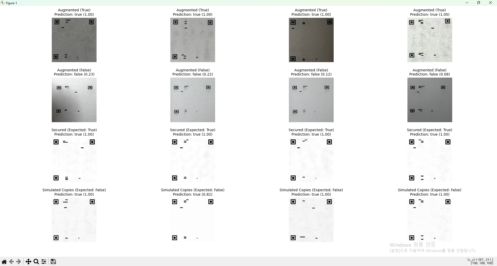
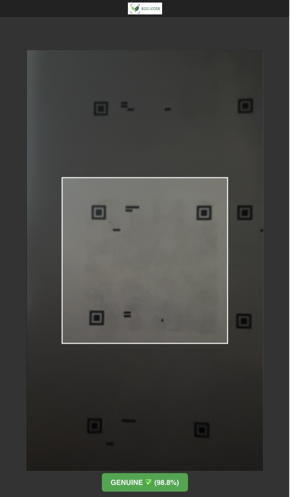
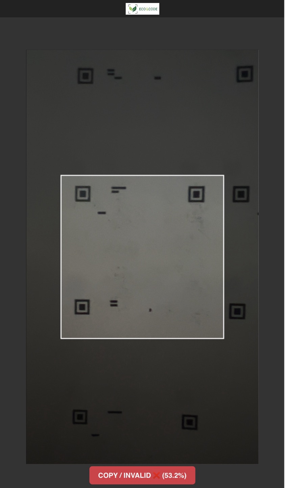
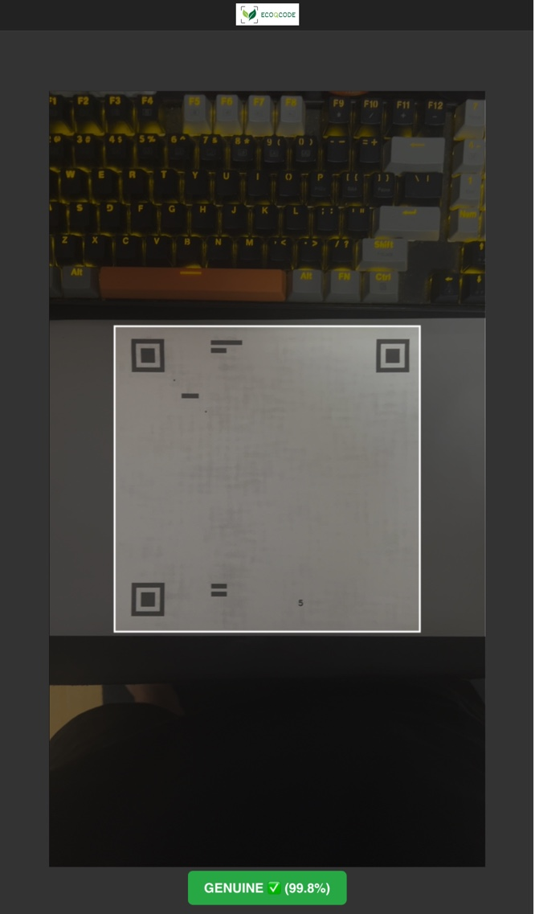

**English** | [한국어](README.ko.md) | [日本語](README.ja.md)

---

# TrueQR: A Project for QR Code Forgery Detection

## Abstract

This project's primary goal was to develop a logic capable of distinguishing between an original, secured QR code and a counterfeit version created by scanning or copying. The core idea was to embed a fragile "encryption" or digital watermark into the original QR code image. This watermark is designed to be destroyed or significantly altered during the copying process, making forgeries detectable.

This document outlines the methodology, the success in a controlled digital environment, and the challenges discovered when applying the technique to real-world scenarios involving physical media and cameras.

## Core Concepts & Methodology

The verification process is not designed to find generic artifacts of copying, but to detect the degradation of a specific, fragile signal embedded within the QR code's pixel data. This embedded watermark is engineered to be robust enough to survive normal viewing but fragile enough to be destroyed by print-scan or digital-to-analog conversion processes.

The methodology involves three primary signature components, each targeting a different characteristic of the image.

#### 1. Perceptual Hash (pHash)

A perceptual hash is used to create a "fingerprint" of the image's low-frequency components. This provides a general representation of the QR code's structure that is robust to minor scaling and compression but will change if the overall structure is altered.

The process is as follows:
1.  The image $I$ is converted to grayscale and resized to a fixed size (e.g., 32x32).
2.  The 2D Discrete Cosine Transform (DCT) is applied:
    $$C = \text{DCT}(I)$$
3.  A low-frequency $8 \times 8$ sub-region $C_{low}$ is extracted.
4.  The median value $m$ of the coefficients in $C_{low}$ (excluding the DC component $C[0,0]$) is calculated.
5.  A 63-bit hash $H$ is generated where each bit $h_i$ corresponds to a coefficient $c_i$ in $C_{low}$:
    $$
    h_i = 
    \begin{cases} 
    1 & \text{if } c_i > m \\
    0 & \text{otherwise}
    \end{cases}
    $$
    
**Verification:** The Hamming distance $d_H$ between the pHash of the test image ($H_{test}$) and the reference image ($H_{ref}$) is calculated. The check passes if the distance is below a certain threshold $\tau_p$:
$$d_H(H_{test}, H_{ref}) \le \tau_p$$

#### 2. High-Frequency Grid (HFG) Strength

This metric measures a high-frequency pattern secretly embedded across the image. A faint grid of pixels in the original "secured" image is made slightly brighter than its immediate neighbors. This subtle difference is destroyed by the blurring inherent in any copying process.

1.  A grid $G$ is defined by sampling pixels from the grayscale image $I$ at a fixed interval, $s$:
    $$G = \{I(x, y) \mid x \pmod s = 0, y \pmod s = 0\}$$
2.  The strength $S_{HFG}$ is the difference between the mean intensity of the grid pixels ($\mu_G$) and the mean intensity of the non-grid pixels ($\mu_{\neg G}$):
    $$S_{HFG} = \mu_G - \mu_{\neg G}$$

**Verification:** A genuine image will have a positive $S_{HFG}$ value, as the grid points are brighter. The check passes if the measured strength is above a minimum threshold $\tau_h$:
$$S_{HFG}(I_{test}) \ge \tau_h$$

#### 3. Frequency Peak Ratio (FPR)

This technique embeds a periodic signal (a sine wave) at a specific, known frequency $k$ along one axis of the image. This creates a sharp peak in the image's frequency spectrum that is highly susceptible to compression and resampling artifacts.

1.  A representative row $r(x)$ (e.g., the middle row) is extracted from the image.
2.  The 1D Fast Fourier Transform (FFT) is computed: 
    $$R(f) = \text{FFT}(r(x))$$
3.  The magnitude $M(f) = |R(f)|$ of the spectrum is calculated.
4.  The ratio $R_{FP}$ is the magnitude at the target frequency $M(k)$ divided by the mean magnitude of the background frequencies $\mu_{bg}$:
    $$R_{FP} = \frac{M(k)}{\mu_{bg}}$$

**Verification:** A genuine image will exhibit a strong peak at the frequency $k$. The check passes if the ratio is above a minimum threshold $\tau_f$:
$$R_{FP}(I_{test}) \ge \tau_f$$


## Outcomes and Key Findings

### 1. Success in Digital PNG-to-PNG Comparison

**This method was highly successful in a purely digital context.** To validate this, we can use the `src/test_verify.py` script, which uses the original signal processing logic to check for the fragile watermark.

When testing against the original, digitally **secured** images, the script correctly identifies all of them as genuine:

```
$ python src/test_verify.py --mode verify --input_dir "True_data/secured" --meta "config/signatures.json"

ecoqcode (1).png: GENUINE  |  detail={'hamming': 0, 'hf_strength': 0.573, 'fft_peak_ratio': 26.27, ...}
ecoqcode (10).png: GENUINE  |  detail={'hamming': 0, 'hf_strength': 0.540, 'fft_peak_ratio': 10.66, ...}
ecoqcode (11).png: GENUINE  |  detail={'hamming': 0, 'hf_strength': 0.568, 'fft_peak_ratio': 3.04, ...}
...
```

Conversely, when testing against the **simulated copies** (which mimic the degradation from printing and scanning), the script correctly identifies all of them as fakes:

```
$ python src/test_verify.py --mode verify --input_dir "False_data/simulated_copies" --meta "config/signatures.json"

ecoqcode (1)_copy1.png: COPY/ALTERED  |  detail={'hamming': 4, 'hf_strength': 0.127, 'fft_peak_ratio': 3.46, ...}
ecoqcode (1)_copy2.png: COPY/ALTERED  |  detail={'hamming': 0, 'hf_strength': 0.052, 'fft_peak_ratio': 12.74, ...}
ecoqcode (1)_copy3.png: COPY/ALTERED  |  detail={'hamming': 4, 'hf_strength': 0.075, 'fft_peak_ratio': 1.60, ...}
...
```

This confirms that the core principle of using a fragile, breakable watermark is valid in a purely digital domain where environmental variables are eliminated. To the naked eye, the two sets of PNG files appear virtually identical.

### 2. The Challenge of Physical Media

The project's primary challenge emerged when moving from digital files to real-world application. When attempting to verify a printed QR code using a smartphone camera (iPhone 13 Pro), the results became inconsistent.

**Reason for Inconsistency:** The verification logic was so sensitive that it was affected by the physical properties of the medium itself. The inference results changed based on:
*   The texture, gloss, and color of the paper.
*   Ambient lighting conditions.
*   The specific angle and distance of the camera.

This means that for the system to work reliably, it requires a **highly controlled environment**. For example, verification is possible if the QR code is always printed on a specific, standardized type of paper under controlled lighting. This limits the universal applicability of the method but proves its viability for high-security scenarios where the printing medium can be standardized.

### 3. Case Study: iPhone 13 Pro Camera Inference from a Display

To further investigate the challenges of real-world verification, a specific test was conducted. A genuine, encrypted QR code and a known forged QR code were displayed on a screen and then scanned using an iPhone 13 Pro.

**Test 1: Scanning the Genuine QR Code**

.jpg)

*   **Result:**
    *   `pHash Dist : 12 (Max : 18) -> OK`
    *   `FFT Ratio : 8.589 (Min : 1.5) -> OK`
    *   `HF Strength: -0.365 (Min: 0.15) -> NO`

**Test 2: Scanning the Forged QR Code**

.jpg)

*   **Result:** The forged code produced nearly identical results, also passing the `pHash Dist` and `FFT Ratio` checks while failing the `HF Strength`.

**Analysis:**
The critical insight comes from comparing these two tests. At first glance, the genuine test seems partially successful because two of the three metrics passed. However, the fact that the known forgery *also* passes the exact same two metrics renders them useless for verification in this context. The `HF Strength` metric failed for both, but since it can't distinguish between the two, it is also an unreliable indicator.

**Conclusion:**
This comparative test proves that when verifying from a display, the current logic is unable to distinguish a genuine code from a forged one. The screen's display properties (pixels, light, etc.) create a consistent set of artifacts for *any* QR code being scanned, which leads to false positives on the `pHash` and `FFT` checks. This reinforces the conclusion that **verification from a screen is currently not possible** with this method.

### 3. Evolving the Approach: From Signal Processing to Deep Learning

The initial tests, particularly those involving scanning from a screen, revealed that the signal processing method was too fragile and susceptible to environmental noise. While it worked in a controlled digital environment, it failed to provide reliable results in more realistic scenarios.

**Initial tests with printed materials yielded mixed results.** A genuine printed QR code was correctly identified, as shown below:

.jpg)

However, when testing with high-quality fakes (A4 paper copies), the system struggled. While it often identified them as fakes, it would sometimes misclassify them as genuine, highlighting the method's unreliability.

_1.jpg)
_2.jpg)
*Caption: While often detected as fakes, these high-quality copies were sometimes misclassified as genuine.*

To overcome these limitations and build a more robust verification system, the project pivoted to a **Deep Learning approach using a Convolutional Neural Network (CNN)**. The new goal was to train a model to learn the visual features that differentiate genuine QR codes from fakes, rather than relying on a single, fragile embedded signal.

#### 3.1 Data Collection for the CNN Model

A comprehensive dataset was collected to train the model, focusing on realistic variations.

**Genuine Data (155 originals):**
*   **High-Quality (62 images):** A secure QR code was printed and photographed with an iPhone 13 Pro.
    *   31 images in a dark environment.
    *   31 images in bright, natural light.
*   **Low-Quality (93 images):** To improve robustness, additional images were captured from a distance, resulting in lower resolution.
    *   31 images in a dark environment.
    *   31 images under bright fluorescent light.
    *   31 images in bright, natural light.

**Fake Data (124 originals):**
*   **1st Generation Copies (62 images):** The original printed QR was photocopied once.
*   **2nd Generation Copies (62 images):** The 1st generation copies were photocopied again, simulating further degradation.

#### 3.2 Data Augmentation

To create a larger and more diverse training set, all 279 original images (155 genuine + 124 fake) were **augmented by a factor of 10**. The augmentations included random variations in:
*   Noise
*   Brightness

This resulted in a total dataset of 2,790 images for training and validation.

#### 3.3 Model Training and Performance

A CNN model was trained on the augmented dataset. The training process yielded highly promising results, achieving a **validation accuracy of over 99%**. This indicates that the model learned to effectively distinguish between genuine and fake QR code images.

#### 3.3.1 Model Architecture

The model leverages **transfer learning** by using a pre-trained, well-established architecture as its base. This approach allows the model to benefit from the powerful feature extraction capabilities learned from a massive dataset (ImageNet).

The architecture consists of two main parts:

1.  **Base Model:** `MobileNetV2`, provided by `tf.keras.applications`.
    *   It is initialized with `imagenet` weights.
    *   The entire base model is "frozen" (`trainable = False`), meaning its weights are not updated during training. It acts as a fixed feature extractor.

2.  **Custom Classifier Head:** A new set of layers was added on top of the `MobileNetV2` base to adapt it for our specific binary classification task (Genuine vs. Fake).
    *   `GlobalAveragePooling2D`: To reduce the spatial dimensions of the features from the base model.
    *   `Dropout (rate=0.2)`: A regularization technique to prevent overfitting.
    *   `Dense (1, activation='sigmoid')`: The final output layer with a single neuron and a sigmoid activation function, which outputs a probability score between 0 and 1.

The model was compiled with the `Adam` optimizer (learning rate of 0.001) and `BinaryCrossentropy` loss function, which are standard choices for binary classification tasks.

**Model Summary:**

```
Model: "functional"
_________________________________________________________________
 Layer (type)                Output Shape              Param #
=================================================================
 input_layer (InputLayer)    [(None, 224, 224, 3)]     0

 mobilenetv2_1.00_224        (None, 7, 7, 1280)        2,257,984
 (Functional)

 global_average_pooling2d    (None, 1280)              0
 (GlobalAveragePooling2D)

 dropout (Dropout)           (None, 1280)              0

 dense (Dense)               (None, 1)                 1,281
=================================================================
 Total params: 2,259,265
 Trainable params: 1,281
 Non-trainable params: 2,257,984
```
*(Note: The preprocessing layers are part of the model but are omitted from this summary for brevity.)*

The detailed training history, including accuracy and loss curves, is shown below:


#### 3.4 Verification and Limitation Analysis

Following the successful training, the model's performance was evaluated using the `src/visual_test.py` script to see how it would perform on various data categories.

The results, shown in the image below, revealed a critical flaw in the model's logic.



**Analysis:**
*   **Success:** The model is highly effective at distinguishing between photographs of a genuine printed QR code (`Augmented (True)`) and photographs of a simple paper copy (`Augmented (False)`).
*   **Failure:** The model incorrectly classifies all digitally altered fakes (`Simulated Copies (Expected: False)`) as "True".

This outcome strongly suggests that the model has not learned the *specific* fragile watermark pattern we embedded. Instead, it appears to be making predictions based on more general features that distinguish a photo of a print from a photo of a copy (e.g., texture, moiré patterns, subtle lighting changes). In essence, it is detecting the presence of *any* print-like pattern, not the *correct* one.

### 4. Further Experiments with Hybrid Models

The initial analysis showed that the CNN model was not learning the specific watermark. The next logical step was to create a model that could more directly analyze the watermark's quantitative features.

#### 4.1 Experiment 1: Hybrid Model on Digital Data
To force the model to learn the specific patterns, a hybrid approach was developed. This multi-input model was trained not only on the image data but also on the three signature values (`phash`, `hf_strength`, `fft_peak_ratio`) associated with each digital image. The model was trained on the `secured` (True) and `simulated_copies` (False) datasets. While training results were excellent, a visual test showed that the model failed completely on real-world images (photos taken with a camera), classifying all of them as `false`. This confirmed that the fragile watermark was being destroyed by the print-and-scan process.


#### 4.2 Experiment 2: Hybrid Model on Real-World Data
Given the failure on camera images, the next experiment was to train the same hybrid model on a more realistic dataset (`augmented_data`). The results, however, were largely the same. The model learned to classify the pristine digital QR codes correctly but failed to find any meaningful distinction between the photos of genuine prints and the photos of copies.


This led to the conclusion that this specific fragile watermarking method, even when analyzed by a hybrid model, is not robust enough for the physical print-and-scan-and-verify workflow.

### 5. Final Validation with CNN Model and Size Dependency Analysis

Given that the primary goal is camera-based inference and the hybrid models did not yield satisfactory results on real-world data, we returned to the original CNN-only model which had shown the most promise. Live tests were conducted using the web camera application to validate its real-world performance.

#### 5.1 Successful Verification on Standard-Sized QR Codes
The results were positive. When testing with a standard-sized QR code printed on A4 paper, the model could successfully distinguish between a genuine print and its copies.

*   **Genuine:** A QR code printed from the original source (`Test_origin.jpg`) was correctly identified as GENUINE.
*   **Copies:** First and second-generation copies (`Test_Onecopy.jpg`, `Test_Doublecopy.jpg`) were correctly identified as counterfeit.

This demonstrates that the model is capable of identifying the degradation of the watermark pattern caused by photocopying under these conditions.

| Genuine Original | 1st Generation Copy | 2nd Generation Copy |
| :---: | :---: | :---: |
|  |  |  |

#### 5.2 Size Dependency and Failure on Large QR Codes
A critical limitation was discovered when testing with a larger-sized QR code. When a large QR was printed and then copied, the model incorrectly classified the copy as GENUINE.

The image below (`Test_BigQR.jpg`) shows a real-time inference result from the web application. The QR code being scanned is a **first-generation copy**, yet the model incorrectly identifies it as genuine. This is an undesirable result.



**Analysis:**
The physical size of the QR code is a critical variable. When a larger QR code is copied, the embedded fragile patterns are also scaled up, making them more robust and less likely to be destroyed by the copying process.

*   **On the large copy**, a significant number of watermark patterns remain visually identifiable, which is why the model classifies it as genuine.
*   **On the small copy**, these patterns are almost completely eliminated or reduced to indistinct dots, allowing the model to correctly identify it as a fake.

#### 5.3 Final Conclusion
The CNN-only model is effective for verifying QR codes on standard A4-sized paper. It can reliably distinguish between genuine prints and copies at this scale. However, the model's validity is highly dependent on the physical print size. It is not effective for larger QR codes where the watermark pattern survives the copying process. This means the current system is viable but requires a controlled print size for reliable verification.

## Future Potential

The ultimate goal of this research is to develop a watermark that achieves two conflicting yet essential properties:
1.  **Perfect Robustness:** The watermark should be consistently detectable by a standard camera after being printed from a genuine digital source.
2.  **Perfect Fragility:** The watermark should be completely destroyed or altered beyond recognition when the genuine print is photocopied.

In essence, the challenge is to develop a technology that can reliably recognize a pristine QR code's unique, embedded hash watermark while guaranteeing its destruction upon replication.

This remains an active and challenging area of research. While developing such a system is a significant undertaking for an individual researcher due to time and resource constraints, we believe it is an achievable technology. Further research into advanced signal processing, novel materials, or machine learning models trained to generate optimal patterns could unlock this potential.

## How to Use This Project

### Prerequisites
*   Python 3.x
*   Required Python libraries (e.g., OpenCV, NumPy, scikit-image). You can install them via pip:
    ```bash
    pip install opencv-python numpy scikit-image
    ```
*   For web-based verification: `Flask` and `ngrok`.
    ```bash
    pip install Flask
    ```

### Usage 1: Verifying a PNG File

To verify a local QR code image file, you can run the `test_verify.py` script from your terminal.

**Command:**
```bash
python test_verify.py --image "path/to/your/qrcode.png"
```
The script will analyze the image and output whether it believes the file is genuine or a forgery.

### Usage 2: Web-Based Camera Verification (Experimental)

This setup allows you to use your computer's or phone's camera to attempt real-time verification.

**Note:** As stated above, this method is experimental and likely to fail, but it demonstrates the intended real-world application.

**Step 1: Start the Local Web Server**

The web application is located in the `OCR/` directory. Start the Flask server. It is assumed to run on port 8000.

```bash
cd OCR
python app.py
```

**Step 2: Expose the Server with ngrok**

Modern web browsers require a secure `https://` connection to access camera hardware. `ngrok` is a tool that creates a secure public URL for your local server.

In a **new terminal window**, run the following command:

```bash
ngrok http 8000
```

**Step 3: Access the Application**

`ngrok` will provide you with a public HTTPS URL (e.g., `https://random-string.ngrok.io`). Open this URL in the web browser of the device you want to use for scanning (e.g., your iPhone). You can then grant camera access to the site and attempt to verify a QR code.
