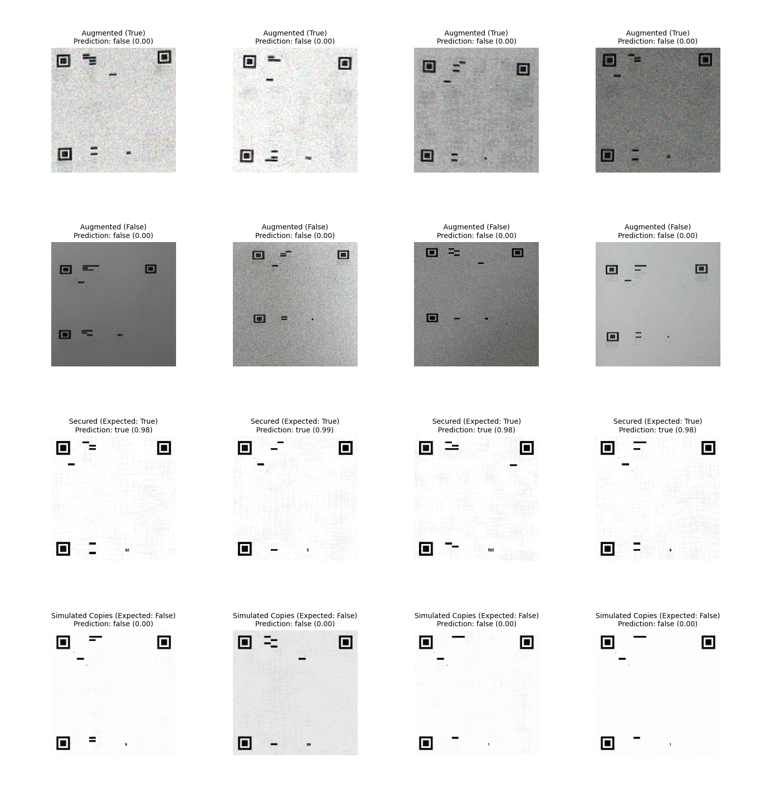

[**English**] | [한국어](README.ko.md) | [日本語](README.ja.md)

---

# TrueQR: QR Code Forgery Prevention Project

## Overview

The primary goal of this project was to develop a logic capable of distinguishing between an original, secured QR code and a counterfeit version created through scanning or copying. The core idea is to embed a fragile "encryption" or digital watermark into the original QR code image. This watermark is designed to be destroyed or significantly altered during the copying process, thus enabling the detection of forgeries.

This document outlines the methodology, its success in a controlled digital environment, and the challenges discovered when applying the technology to real-world scenarios involving physical media and cameras.

## Core Concepts & Methodology

The verification process is not designed to look for common signs of copying but to detect the degradation of a specific, fragile signal embedded within the QR code's pixel data. This embedded watermark is robust enough to withstand normal viewing but fragile enough to be destroyed by the print-scan or digital-to-analog conversion process.

### 1. Perceptual Hash (pHash)

A **Perceptual Hash (pHash)** is a method that generates a **fingerprint** based on the **low-frequency components** of an image. This fingerprint provides a general representation of the **QR code's structure** and is robust against minor **scaling** or **compression**, but its value changes if the overall structure is altered. The process can be broken down as follows:

#### **pHash Generation Steps:**

1.  **Convert to Grayscale and Resize**

    First, the image $I$ is **converted to grayscale** and resized to a fixed dimension (e.g., $32 \times 32$). 

    > **What is Grayscale Conversion?**
    >
    > Grayscale conversion is the process of compressing the R (Red), G (Green), and B (Blue) 3-channel color information of each pixel in a color image into **single-channel luminance (brightness) information**. In other words, it's the task of changing "color" to "black and white shades." 
    >
    > A widely used conversion formula applies weights based on how bright each color appears to the human eye. This formula reflects the human visual characteristic of perceiving green (G) as the brightest and blue (B) as the darkest.
    >
    > $$\text{Grayscale} = (0.299 \times R) + (0.587 \times G) + (0.114 \times B)$$
    >
    > For example, a pixel with color values `R=200, G=100, B=50` would be converted to a single brightness value of approximately `118.2`. This simplifies 3-dimensional color information into 1-dimensional brightness information.

    -   This step simplifies the image by removing color information and makes the size consistent, allowing subsequent operations (like DCT) to focus solely on structural features.

2.  **Apply 2D Discrete Cosine Transform (DCT)**

    A **2D DCT (Discrete Cosine Transform)** is applied to the grayscaled image $I$ to transform it into a frequency-domain matrix $C$.

    $$C = \text{DCT}(I)$$

    > **The Principle of DCT (Discrete Cosine Transform)**
    >
    > DCT is a powerful mathematical tool that transforms an image's pixel brightness values from the **spatial domain** to the **frequency domain**. To understand this process, let's first look at a basic **1D DCT**. 
    >
    > The DCT transform $F(u)$ for a 1D data array (e.g., a single row of an image) $f(x)$ is defined as:
    >
    > **[ 1D DCT Formula ]**
    >
    > $$F(u) = \alpha(u) \sum_{x=0}^{N-1} f(x) \cos\[\frac{(2x+1)u\pi}{2N}\]$$
    >
    > (where $\alpha(u)$ is a normalization coefficient, $\sqrt{1/N}$ for $u=0$ and $\sqrt{2/N}$ for $u>0$.)
    >
    > The **2D DCT** is an extension of this 1D DCT to two dimensions. It yields the same result as applying a 1D DCT to all **rows** of an image, and then applying a 1D DCT again to all **columns** of the resulting matrix. The full formula for 2D DCT is:
    >
    > **[ 2D DCT Formula ]**
    >
    > $$F(u,v) = \alpha(u) \alpha(v) \sum_{x=0}^{N-1} \sum_{y=0}^{M-1} f(x,y) \cos\[\frac{(2x+1)u\pi}{2N}\] \cos\[\frac{(2y+1)v\pi}{2M}\]$$
    >
    > This transformation allows us to decompose the complex visual information of an image into frequency components representing 'slow changes' and 'fast changes.'
    >
    > -   **Low-frequency:** Refers to **large areas where color or brightness changes slowly**. For example, the smooth colors of the sky or a wall, and the overall structure and shape of the image.
    > -   **High-frequency:** Refers to **parts where pixel values change rapidly**, representing fine details, edges, textures, and noise in the image.
    >
    > When 2D DCT is applied, the **top-left** of the transformed matrix ($C$) concentrates the low-frequency components, while the high-frequency components are concentrated towards the **bottom-right**. pHash uses only the low-frequency components that form the core skeleton of the image.

    -   **Summary:** DCT transforms the image from the spatial domain to the **frequency domain**, enabling the separation of the image's **low-frequency** (large structures) and **high-frequency** (details) components.

3.  **Extract the 8x8 Low-Frequency Area**

    After the DCT transformation in step 2, the image's frequency information is arranged by position in the matrix. Using this principle, we extract the low-frequency area that represents the core structure of the image.

    > **Why is the top-left the low-frequency area?**
    >
    > A key feature of 2D DCT is the **Energy Compaction** effect. It has the property of concentrating most of the visual information, or energy, into a few low-frequency coefficients (top-left).
    >
    > -   **Top-left `C[0,0]` (DC Coefficient):** This is the most important low-frequency component, representing the **average brightness** of the image block. It usually has the largest value.
    > -   **Around the top-left:** As you move away from the DC coefficient (to the right and down), the components represent progressively **higher frequencies**, and their values generally decrease rapidly.
    >
    > **[ Simple 4x4 Matrix 2D DCT Example ]**
    >
    > To aid understanding, let's assume we have a simple 4x4 image block with brightness values where the top-left is bright and the bottom-right is dark.
    >
    > **Input Brightness Values (f(x, y))**
    >
    > $$\begin{bmatrix}255 & 200 & 150 & 100 \\\\\ 200 & 150 & 100 & 50 \\\\\ 150 & 100 & 50 & 0 \\\\\ 100 & 50 & 0 & 0 \\\\\end{bmatrix}$$
    >
    > The **result of applying 2D DCT (F(u, v))** on this matrix is as follows (rounded to the nearest integer):
    >
    > $$\begin{bmatrix}\mathbf{401} & \mathbf{-137} & \mathbf{27} & \mathbf{-8} & \\\\\\mathbf{-137} & \mathbf{-2} & \mathbf{-8} & \mathbf{2} \\\\\\mathbf{27} & \mathbf{-8} & \mathbf{2} & \mathbf{-2} \\\\\\mathbf{-8} & \mathbf{2} & \mathbf{-2} & \mathbf{1}\end{bmatrix}$$
    >
    > As you can see, the **largest energy (absolute value of the coefficients) is concentrated in the top-left**, and the values approach zero towards the bottom-right.

    In pHash, only the **top-left 8x8 area ($C_{\text{low}}$)** of the full 32x32 DCT matrix, where the core energy is gathered, is used. These 64 coefficients are sufficient to represent the overall structure of the image and is an efficient method also widely used in JPEG compression.

    -   **Summary:** The extracted 8x8 low-frequency components represent the **overall brightness** and **core shape** of the image.

4.  **Calculate the Median**

    This step sets a reference point for converting the 8x8 low-frequency area into a hash of 0s and 1s. The first value of the 8x8 matrix, `C[0,0]`, represents the average brightness of the entire image block and is not suitable for comparing structural features. Therefore, the remaining 63 frequency coefficients are used.

    To find a representative reference point for these 63 values, the **median** is calculated. The median is the value that is exactly in the middle when the given values are sorted by size. For example, for the 5 values `[1, 3, 5, 7, 9]`, the median is `5`.

    $$m = \text{median}(C_{\text{low}}[1:, 1:])$$

    -   The calculated median `m` serves as the final baseline (threshold) for determining the hash bits as 0 or 1 in the next step.

**5. Generate the 63-bit Hash**

In this final step, the low-frequency information of the image is converted into a unique 63-bit digital fingerprint, the **perceptual hash (pHash)**, using the median `m` calculated earlier as a threshold.

The specific process is as follows. The 8x8 low-frequency area (`C_low`) extracted in step 3 contains a total of 64 frequency coefficients. Each of these coefficients is compared with the median `m` and converted to either 0 or 1.

An important point here is that the **DC component (`C[0,0]`)**, which represents the average brightness, **is excluded from this comparison process**. Only the 63 AC coefficients, which represent the structure of the image, are used to construct the hash. This is why a '63-bit' hash is generated instead of a '64-bit' one.

The rule for comparing each AC coefficient ($c_i$) with the median ($m$) is as follows:

$$h_i = \begin{cases} 1 & \text{if } c_i > m \\\\0 & \text{otherwise}\end{cases}$$

-   **Interpretation:** For each of the 63 AC coefficients, if its value is **greater than** the median `m`, it is assigned a `1`; if it is less than or equal to `m`, it is assigned a `0`.

> **[ Simple Hash Generation Example ]**
>
> Let's assume the first 5 of the 63 AC coefficients are `[15.3, -20.1, 5.5, 30.9, -2.0]` and the median `m` calculated in step 4 is `4.5`.
>
> The result of comparing each coefficient with `m` is as follows:
> -   `15.3 > 4.5`  -> Bit assigned: `1`
> -   `-20.1 > 4.5` -> Bit assigned: `0`
> -   `5.5 > 4.5`  -> Bit assigned: `1`
> -   `30.9 > 4.5` -> Bit assigned: `1`
> -   `-2.0 > 4.5` -> Bit assigned: `0`
>
> Repeating this process 63 times creates a 63-digit binary string like `10110...`.

-   **Summary:** This process generates a 63-bit **binary string**, which becomes the final **perceptual hash** of the image. This hash serves as a unique fingerprint representing the low-frequency structure of the image.

#### **Verification using Hamming Distance:**
The **Hamming distance** $d_H$ is calculated between the pHash of the **test image** ($H_{\text{test}}$) and the pHash of the **reference image** ($H_{\text{ref}}$).
$$d_H(H_{\text{test}}, H_{\text{ref}}) = \sum_{i=1}^{63} \left| h_{\text{test}, i} - h_{\text{ref}, i} \right|$$
- If this Hamming distance is less than or equal to a certain threshold $\tau_p$, the verification passes.

$$d_H(H_{\text{test}}, H_{\text{ref}}) \leq \tau_p$$

- A smaller distance indicates that the two images are **similar** or **identical**.

#### **pHash Summary:**

-   **pHash** generates a **unique fingerprint** based on the **low-frequency components** of an image.
-   It is **robust against minor changes** like **scaling** or **compression**, but its value changes if the **overall structure** of the image is altered.
-   **Hamming distance** is used to compare two hash values to verify the similarity of images.

#### **Applications of pHash:**
-   Detecting duplicate images
-   Image matching for similarity comparison
-   Efficient image indexing based on perceptual similarity

### 2. High-Frequency Grid (HFG) Strength

This metric is a technique that embeds a **fragile watermark** into an image, which is easily damaged upon copying, and then measures the extent of that damage to determine authenticity.

#### Watermark Embedding Principle
A fine grid pattern, invisible to the human eye, is hidden in the original "secured" image. This pattern is created as follows:

1.  'Grid points' are set at regular intervals ($s$) across the entire image.
2.  The brightness values of the pixels corresponding to these grid points are **slightly increased** compared to the surrounding pixels (e.g., if the original brightness was 150, it is changed to 155).

This subtle difference is not perceptible under normal viewing conditions, but it is easily destroyed by the **blurring** that inevitably occurs during copying processes like printing and then scanning, or capturing a screen.

#### Verification Principle and Example
During verification, the average brightness of the grid points is compared with the average brightness of the remaining non-grid pixels, and the difference is calculated.

> **[ Simple 4x4 Image HFG Strength Calculation Example ]**
>
> To aid understanding, let's assume we have a 4x4 image block with a grid interval of 2 ($s=2$). The grid points would be at locations (0,0), (0,2), (2,0), and (2,2).
>
> **1. For a Genuine Image**
>
> The brightness of the grid points (110) is kept slightly higher than the surroundings (100).
>
> **Input Image $I_{\text{genuine}}$**
>
> $$\begin{bmatrix}\mathbf{110} & 100 & \mathbf{110} & 100 \\\\\\ 100 & 100 & 100 & 100 \\\\\\mathbf{110} & 100 & \mathbf{110} & 100 \\\\\\ 100 & 100 & 100 & 100\end{bmatrix}$$
>
> -   **Grid Pixel Average ($\\mu_G$):** `(110 + 110 + 110 + 110) / 4 = 110`
> -   **Non-Grid Pixel Average ($\\mu_{\neg G}$):** `(100 * 12) / 12 = 100`
> -   **HFG Strength ($S_{HFG}$):** `110 - 100 =` **`10`**
>
> **2. For a Forged (Copied) Image**
>
> Due to the blurring effect of the print-scan process, the high brightness values of the grid points spread to the surroundings, causing an overall averaging effect.
>
> **Input Image $I_{\text{forged}}$**
>
> $$\begin{bmatrix}\mathbf{102} & 101 & \mathbf{102} & 101 \\\\\\ 101 & 101 & 101 & 101 \\\\\\mathbf{102} & 101 & \mathbf{102} & 101 \\\\\\ 101 & 101 & 101 & 101\end{bmatrix}$$
>
> -   **Grid Pixel Average ($\\mu_G$):** `(102 + 102 + 102 + 102) / 4 = 102`
> -   **Non-Grid Pixel Average ($\\mu_{\neg G}$):** `(101 * 12) / 12 = 101`
> -   **HFG Strength ($S_{HFG}$):** `102 - 101 =` **`1`**

**Verification:**
As seen in the example, the HFG strength of the genuine image (10) is significantly higher than that of the forgery (1). Using this principle, if the measured strength $S_{HFG}$ is greater than or equal to a predefined minimum threshold $\\tau_h$, it is determined to be genuine.

$$S_{HFG}(I_{\text{test}}) \ge \tau_h$$

If the threshold $\\tau_h$ were `5`, the genuine image would pass, and the forged image would fail.

### 3. Frequency Peak Ratio (FPR)

This technique involves hiding a 'secret signal' with a specific frequency in the image and measuring the clarity of that signal to determine authenticity. To draw an analogy with radio, it's like broadcasting a secret radio program at a specific frequency (`k` MHz) that only we know about, and then checking if that broadcast is still clearly audible in the scanned image.

#### Watermark Embedding Principle
A periodic signal (sine wave) with a specific frequency $k$ is very subtly added across each row (or column) of the original image. This creates a faint wave of brightness, either horizontally or vertically, that is difficult to perceive with the naked eye. This delicate pattern is very vulnerable to data loss that occurs during image compression, resampling, and the print-scan process.

#### Verification Principle and Example
During verification, a line of pixel data (the signal) is extracted from the image, and its frequency components are analyzed using a **Fourier Transform (FFT)**.

1.  **Signal Extraction and Fourier Transform (FFT)**

    The brightness values of a single row of pixels from the middle of the image ($r(x)$) are treated as a discrete signal $x_n$, and a **Discrete Fourier Transform (DFT)** is applied to it. (FFT is the name of an efficient algorithm that calculates this DFT quickly.)

    **[ 1D Discrete Fourier Transform (DFT) Formula ]**

    $$X_k = \sum_{n=0}^{N-1} x_n \cdot e^{-i \frac{2\pi}{N} kn}$$

    This formula calculates how much of each frequency component ($k$) the input signal ($x_n$) contains. The resulting value $X_k$ is a complex number, and we are only interested in its **magnitude**, $M(k) = |X_k|$. This magnitude represents the 'signal strength' of that frequency.

3.  **Spectrum of a Genuine Image**

    In a genuine image, the sine wave at the frequency $k$ that we embedded remains clear, so the signal at that point in the frequency spectrum forms a **very strong peak**.

    -   Signal magnitude at the target frequency ($k$): $M(k) = 150$
    -   Average magnitude of surrounding background frequencies: $\\mu_{bg} = 10$
    -   **Peak Ratio ($R_{FP}$):** $M(k) / \\mu_{bg} = 150 / 10 =$ **`15`**

4.  **Spectrum of a Forged (Copied) Image**

    During the copying process, the subtle sine wave pattern is damaged, and the strong peak becomes blurred and weakened, resembling the surrounding noise.

    -   Signal magnitude at the target frequency ($k$): $M(k) = 25$
    -   Average magnitude of surrounding background frequencies: $\\mu_{bg} = 10$
    -   **Peak Ratio ($R_{FP}$):** $M(k) / \\mu_{bg} = 25 / 10 =$ **`2.5`**

**Verification:**
Thus, the peak ratio of the genuine image (15) is much higher than that of the forgery (2.5). If this ratio ($R_{FP}$) is greater than or equal to a predetermined threshold $\\tau_f$, it is considered that the 'secret broadcast' was received clearly, and the image is authenticated as genuine.

$$R_{FP} = \frac{M(k)}{\\mu_{bg}}$$

$$R_{FP}(I_{\text{test}}) \ge \tau_f$$

If the threshold $\\tau_f$ were `7`, the genuine image would pass, but the forged image would not.


## Results & Key Findings

### 1. Success in Digital PNG-to-PNG Comparison

**The method was highly successful in a purely digital context.** This can be verified using the `src/test_verify.py` script, which uses the original signal processing logic to check for the fragile watermarks.

When tested against the original digital **secured** images, the script correctly identifies all of them as genuine:

```
$ python src/test_verify.py --mode verify --input_dir "True_data/secured" --meta "config/signatures.json"

ecoqcode (1).png: GENUINE  |  detail={'hamming': 0, 'hf_strength': 0.573, 'fft_peak_ratio': 26.27, ...}
ecoqcode (10).png: GENUINE  |  detail={'hamming': 0, 'hf_strength': 0.540, 'fft_peak_ratio': 10.66, ...}
ecoqcode (11).png: GENUINE  |  detail={'hamming': 0, 'hf_strength': 0.568, 'fft_peak_ratio': 3.04, ...}
...
```

Conversely, when tested against **simulated copies** (which mimic the degradation from printing and scanning), the script correctly identifies all of them as fakes:

```
$ python src/test_verify.py --mode verify --input_dir "False_data/simulated_copies" --meta "config/signatures.json"

ecoqcode (1)_copy1.png: COPY/ALTERED  |  detail={'hamming': 4, 'hf_strength': 0.127, 'fft_peak_ratio': 3.46, ...}
ecoqcode (1)_copy2.png: COPY/ALTERED  |  detail={'hamming': 0, 'hf_strength': 0.052, 'fft_peak_ratio': 12.74, ...}
ecoqcode (1)_copy3.png: COPY/ALTERED  |  detail={'hamming': 4, 'hf_strength': 0.075, 'fft_peak_ratio': 1.60, ...}
...
```

This confirms that in a pure digital realm, where environmental variables are removed, the core principle of using fragile watermarks is valid. Visually, the two sets of PNG files look nearly identical.

### 2. The Challenge of Physical Media

The project's main challenge emerged when moving from digital files to real-world application. When attempting to verify a printed QR code using a smartphone camera (iPhone 13 Pro), the results were inconsistent.

**Reason for Inconsistency:** The verification logic was too sensitive and was affected by the physical properties of the medium itself. The inference results changed depending on:
*   The texture, gloss, and color of the paper.
*   The ambient lighting conditions.
*   The specific angle and distance of the camera.

This means the system requires a **highly controlled environment** to work reliably. For example, verification is possible if the QR code is always printed on a specific, standardized type of paper under controlled lighting. This limits the universal applicability of the method but proves its viability for high-security scenarios where the print medium can be standardized.

### 3. Case Study: iPhone 13 Pro Camera Inference from a Display

To further investigate the challenges of real-world verification, a specific test was conducted. A genuine, encrypted QR code and a known counterfeit QR code were displayed on a screen and then scanned using an iPhone 13 Pro.

**Test 1: Scanning a Genuine QR Code**

.jpg)

*   **Results:**
    *   `pHash Dist : 12 (Max : 18) -> OK`
    *   `FFT Ratio : 8.589 (Min : 1.5) -> OK`
    *   `HF Strength: -0.365 (Min: 0.15) -> NO`

**Test 2: Scanning a Counterfeit QR Code**

.jpg)

*   **Results:** The counterfeit code produced nearly identical results, passing the `pHash Dist` and `FFT Ratio` checks but failing the `HF Strength`.

**Analysis:**
The critical insight comes from comparing these two tests. At first glance, the genuine test seems partially successful because it passed two of the three metrics. However, the fact that a known counterfeit *also* passes the exact same two metrics renders them useless for verification in this context. The `HF Strength` metric failed for both, but since it cannot distinguish between the two, it is also an unreliable indicator.

**Conclusion:**
This comparative test proves that the current logic cannot distinguish between a genuine and a counterfeit code when verified from a display. The display properties of the screen (pixels, light, etc.) create a consistent set of artifacts for *any* QR code being scanned, causing false positives on the `pHash` and `FFT` checks. This reinforces the conclusion that **verification from a screen is currently not feasible with this method.**

### 3. Evolution of Approach: From Signal Processing to Deep Learning

The initial tests, especially those involving scanning from a screen, showed that the signal processing methods were too fragile and susceptible to environmental noise. While they worked in a controlled digital environment, they failed to provide reliable results in more realistic scenarios.

**Initial tests on printed material yielded mixed results.** A genuine printed QR code, as shown below, was correctly identified:

.jpg)

However, when tested with high-quality fakes (copies on A4 paper), the system struggled. It would often identify them as fakes, but sometimes misclassify them as genuine, undermining the method's reliability.

_1.jpg)
_2.jpg)
*Caption: While often detected as fakes, these high-quality copies were sometimes misclassified as genuine.*

To overcome these limitations and build a more robust verification system, the project pivoted to a **deep learning approach using a Convolutional Neural Network (CNN)**. The new goal was to train a model to learn the visual features that distinguish a genuine QR code from a fake one, rather than relying on a single, fragile embedded signal.

#### 3.1 Data Collection for the CNN Model

A comprehensive dataset was collected to train the model, with a focus on realistic variations.

**Genuine Data (155 originals):**
*   **High-Quality (62 images):** Secured QR codes were printed and photographed with an iPhone 13 Pro.
    *   31 images in a dark environment.
    *   31 images in bright, natural light.
*   **Low-Quality (93 images):** To improve robustness, additional images were captured from a distance, resulting in lower resolution.
    *   31 images in a dark environment.
    *   31 images under bright fluorescent light.
    *   31 images in bright, natural light.

**Fake Data (124 originals):**
*   **1st-Generation Copies (62 images):** The original printed QRs were copied once.
*   **2nd-Generation Copies (62 images):** The 1st-generation copies were copied again to simulate further degradation.

#### 3.2 Data Augmentation

To create a larger and more diverse training set, all 279 original images (155 genuine + 124 fake) were **augmented 10-fold**. The augmentation included random variations in:
*   Noise
*   Brightness

This resulted in a total dataset of 2,790 images for training and validation.

#### 3.3 Model Training and Performance

A CNN model was trained on the augmented dataset. The training process yielded highly promising results, achieving a **validation accuracy of over 99%**. This indicated that the model had effectively learned how to distinguish between genuine and fake QR code images.

#### 3.3.1 Model Architecture

The model uses a well-known, pre-trained architecture, leveraging **transfer learning**. This approach allows the model to benefit from the powerful feature extraction capabilities learned on a massive dataset (ImageNet).

The architecture consists of two main parts:

1.  **Base Model:** `MobileNetV2` from `tf.keras.applications`.
    *   Initialized with `imagenet` weights.
    *   The entire base model is "frozen" (`trainable = False`), so its weights are not updated during training. It acts as a fixed feature extractor.

2.  **Custom Classifier Head:** A new set of layers was added on top of the `MobileNetV2` base to tailor it for the specific binary classification task (genuine vs. fake).
    *   `GlobalAveragePooling2D`: Reduces the spatial dimensions of the features from the base model.
    *   `Dropout (rate=0.2)`: A regularization technique to prevent overfitting.
    *   `Dense (1, activation='sigmoid')`: The final output layer with a single neuron and a sigmoid activation function, which outputs a probability score between 0 and 1.

The model was compiled with the `Adam` optimizer (learning rate of 0.001) and the `BinaryCrossentropy` loss function, which are standard choices for binary classification tasks.

**Model Summary:**

```
Model: "functional"
_________________________________________________________________
 Layer (type)                Output Shape              Param #
=================================================================
 input_layer (InputLayer)    [(None, 224, 224, 3)]     0

 mobilenetv2_1.00_224        (None, 7, 7, 1280)        2,257,984
 (Functional)

 global_average_pooling2d    (None, 1280)              0
 (GlobalAveragePooling2D)

 dropout (Dropout)           (None, 1280)              0

 dense (Dense)               (None, 1)                 1,281
=================================================================
 Total params: 2,259,265
 Trainable params: 1,281
 Non-trainable params: 2,257,984
```
*(Note: Pre-processing layers are part of the model but omitted from this summary for brevity.)*

The detailed training history, including accuracy and loss curves, can be seen here:


#### 3.4 Validation and Limitation Analysis

After successful training, the model's performance was evaluated to see how it performed across different categories of data using the `src/visual_test.py` script.

The results, shown in the image below, revealed a critical flaw in the model's logic.


**Analysis:**
*   **Success:** The model is highly effective at distinguishing between photos of genuine printed QR codes (`Augmented (True)`) and photos of simple paper copies (`Augmented (False)`).
*   **Failure:** The model misclassifies all digitally altered fakes (`Simulated Copies (Expected: False)`) as "True".

This result strongly suggests that the model did not learn the *specific* fragile watermark patterns we embedded. Instead, it appears to be making its predictions based on more general features that distinguish a photograph of a printout from a photograph of a copy (e.g., texture, moiré patterns, subtle lighting changes). In essence, it is detecting the presence of *any* print-like pattern, not the *correct* one.

### 4. Further Experiments with a Hybrid Model

The initial analysis showed that the CNN model was not learning the specific watermark. The next logical step was to create a model that could more directly analyze the quantitative features of the watermark.

#### 4.1 Experiment 1: Hybrid Model on Digital Data
To force the model to learn the specific patterns, a hybrid approach was developed. This multi-input model was trained not only on the image data but also on the three signature values (`phash`, `hf_strength`, `fft_peak_ratio`) associated with each digital image. The model was trained on the `secured` (True) and `simulated_copies` (False) datasets. The training itself was highly successful, achieving near-perfect validation accuracy, as shown below.


However, despite the excellent training results, the visual test results showed that on real images (photos taken with a camera), the model failed completely, classifying all of them as `false`. This confirmed that the fragile watermarks were being destroyed by the print-and-scan process.



#### 4.2 Experiment 2: Hybrid Model on Real Data
Given the failure on camera images, the next experiment was to train the same hybrid model on the more realistic dataset (`augmented_data`). However, the results were largely the same. The model learned how to correctly classify the raw digital QR codes, but it could not find a meaningful distinction between photos of genuine printouts and photos of copies.


This led to the conclusion that this specific fragile watermarking method is not robust enough for a physical print-scan-verify workflow, even when analyzed with a hybrid model.

### 5. Final Validation with CNN Model and Size Dependency Analysis

Since the primary goal was camera-based inference and the hybrid models did not produce satisfactory results on real data, we returned to the original CNN-only model, which had seemed the most promising. Live tests were conducted to validate its real-world performance using a web camera application.

#### 5.1 Successful Validation on Standard-Sized QR Codes
The results were positive. When tested with standard-sized QR codes printed on A4 paper, the model was able to successfully distinguish between genuine printouts and copies.

*   **Genuine:** A QR code printed from the original source (`Test_origin.jpg`) was correctly identified as GENUINE.
*   **Copies:** 1st and 2nd generation copies (`Test_Onecopy.jpg`, `Test_Doublecopy.jpg`) were correctly identified as fakes.

This shows that the model is able to identify the degradation of the watermark pattern caused by copying under these conditions.

| Genuine Original | 1st Gen. Copy | 2nd Gen. Copy |
| :---: | :---: | :---: |
|  |  |  |

#### 5.2 Size Dependency and Failure on Large QR Codes
A significant limitation was discovered when testing with larger-sized QR codes. When a large QR was printed and then copied, the model misclassified the copy as GENUINE.

The image below (`Test_BigQR.jpg`) shows the live inference result from the web application. The QR code being scanned is a **1st-generation copy**, but the model incorrectly identifies it as genuine. This is an undesirable outcome.


**Analysis:**
The physical size of the QR code is a critical variable. When a larger QR code is copied, the embedded fragile patterns are also scaled up, making them more robust and less likely to be destroyed in the copying process.

*   On a **large copy**, a significant number of the watermark patterns remain visually identifiable, which is why the model classifies it as genuine.
*   On a **small copy**, these patterns are almost completely eliminated or reduced to unidentifiable dots, allowing the model to correctly identify it as a fake.

#### 5.3 Final Conclusion
The CNN-only model is effective for verifying QR codes on standard A4-sized paper. At this scale, it can reliably distinguish between genuine printouts and copies. However, the model's validity is highly dependent on the physical print size. It is not effective for larger QR codes where the watermark patterns survive the copying process. This means the current system is viable but requires a controlled print size for reliable verification.

## Potential for Future Development

The ultimate goal of this research is to develop a watermark that satisfies two conflicting but essential properties:
1.  **Perfect Robustness:** A watermark that can be consistently detected by a regular camera after being printed from its original digital source.
2.  **Perfect Fragility:** A watermark that is completely destroyed or altered beyond recognition when a genuine printout is copied.

In essence, the challenge is to develop a technique that can reliably recognize a unique, hashed watermark embedded in an original QR code, while ensuring it is definitively destroyed upon duplication.

This remains an active and challenging area of research. While developing such a system is a significant undertaking for an individual due to time and resource constraints, we believe it is an achievable technology. Further research into advanced signal processing, novel materials, or machine learning models trained to generate optimal patterns could unlock this possibility.

## How to Use This Project

### Prerequisites
*   Python 3.x
*   Required Python libraries (e.g., OpenCV, NumPy, scikit-image). You can install them via pip:
    ```bash
    pip install opencv-python numpy scikit-image
    ```
*   For web-based verification: `Flask` and `ngrok`.
    ```bash
    pip install Flask
    ```

### Usage 1: Verify a PNG File

You can run the `test_verify.py` script from your terminal to check a local QR code image file.

**Command:**
```bash
python test_verify.py --image "path/to/your/qrcode.png"
```
The script will analyze the image and print whether the file is genuine or a counterfeit.

### Usage 2: Web-Based Camera Verification (Experimental)

This setup allows you to attempt real-time verification using your computer's or phone's camera.

**Note:** As mentioned above, this method is experimental and highly likely to fail, but it demonstrates the intended real-world application.

**Step 1: Start the Local Web Server**

The web application is located in the `OCR/` directory. Start the Flask server. We'll assume it runs on port 8000.

```bash
cd OCR
python app.py
```

**Step 2: Expose the Server with ngrok**

Modern web browsers require a secure `https://` connection to access camera hardware. `ngrok` is a tool that creates a secure public URL for your local server.

In a **new terminal window**, run the following command:

```bash
ngrok http 8000
```

**Step 3: Access the Application**

`ngrok` will provide you with a public HTTPS URL (e.g., `https://random-string.ngrok.io`). Open this URL in the web browser on the device you want to use for scanning (e.g., your iPhone). You can then grant the site camera access and try to verify a QR code.

```